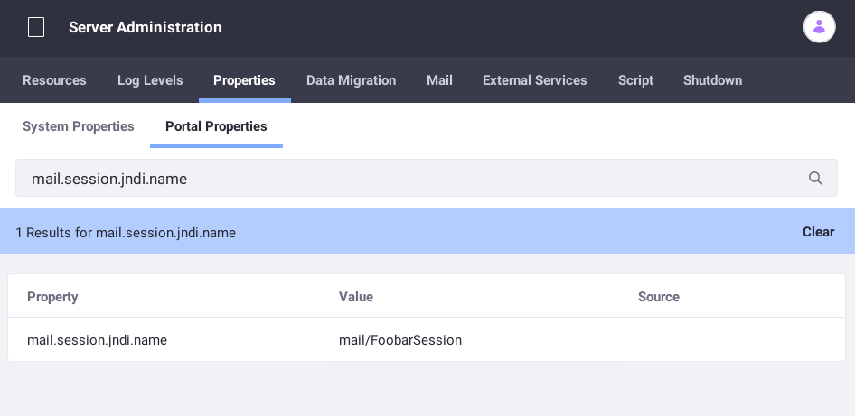

# Portal Properties

Configuration options are specified using *Portal Properties*, sets of name/value pairs read from properties files and Docker environment variables on server startup. [Default values](https://docs.liferay.com/dxp/portal/7.3-latest/propertiesdoc/portal.properties.html) are specified in the `portal-impl.jar/portal.properties` file.

Some properties can be changed through the user interface (UI), but others can only be changed in a properties file or Docker environment variables. These include connecting to a database, declaring the location of the [Liferay Home](./liferay-home.md) folder, and [changing how users authenticate](../securing-liferay/authentication-basics.md#configuring-authentication-type-using-properties) (by screen name instead of by email address).

Liferay installations use properties files. By convention, `portal-ext.properties` should be created in your `[Liferay Home](./liferay-home.md)` folder or `[USER_HOME]` folder to override default property values. You must restart DXP to apply a new or modified properties file.

```warning::
   Never directly modify the ``portal-impl.jar/portal.properties`` file; instead, create a separate file to override properties you want to change. The ``portal-ext.properties`` file has been defined for this purpose.
```

Using a `portal-ext.properties` file to override default properties has these benefits:

* You can copy the file to other Liferay DXP environments and server nodes.
* You can store configurations in a version control system to simplify configuration management.
* Setting properties in the file before initial startup is the quickest way to configure Liferay.

Portal properties are applied to Liferay Docker containers with environment variables (Env variables) and properties files. Please see [Configuring Containers](../installing-liferay/using-liferay-docker-images/configuring-containers.md#using-liferay-env-variables) to configure Docker containers with portal properties.  

**Contents:**

* [Using Portal Properties](#using-portal-properties)
* [Portal Property Priority](#portal-property-priority)
* [Using System Settings and Configuration Files](#using-system-settings-and-configuration-files)

```note::
   As of DXP 7.3, the per-virtual instance portal properties file feature has been removed. DXP no longer applies per-instance properties from files of the format ``portal-[companyId].properties``) to instances matching the company IDs.
```

## Using Portal Properties

When creating `[Liferay Home]/portal-ext.properties`, a best practice is to copy the relevant section from `portal-impl.jar/portal.properties` into your `portal-ext.properties` file, and then change the value to what you want.

```note::
   If you use the `Setup Wizard <../installing-liferay/running-liferay-for-the-first-time.md>`_, DXP sets those properties in a file called `portal-setup-wizard.properties` in ``[Liferay Home]``.
```

Here are a few configuration examples.

### Setting a Database Connection

Database connection properties are most commonly set in a `portal-ext.properties` file. If you want to change the database connection, for example, create a `portal-ext.properties` file and set the [database connection properties](./database-templates.md) to the values you want:

```properties
jdbc.default.driverClassName=org.mariadb.jdbc.Driver
jdbc.default.url=jdbc:mariadb://localhost/lportal?useUnicode=true&characterEncoding=UTF-8&useFastDateParsing=false
jdbc.default.username=joe.bloggs
jdbc.default.password=123456
```

For more database configuration details, see [Database Configurations](./database-configurations.md) and [Database Templates](./database-templates.md).

### Setting the Liferay Home Location

Some application servers (e.g., WebLogic) require [customizing the Liferay Home location](../installing-liferay/installing-liferay-on-an-application-server/installing-on-weblogic.md#declare-the-liferay-home-folder) before deploying the DXP WAR file. The [`liferay.home`](https://docs.liferay.com/dxp/portal/7.3-latest/propertiesdoc/portal.properties.html#Liferay%20Home) property sets the location.

```properties
liferay.home=/home/jbloggs/liferay
```

### Changing How Users Authenticate

To change how users authenticate, add one of the following `company.security.auth.type` property values.

```properties
company.security.auth.type=emailAddress
```

```properties
company.security.auth.type=screenName
```

```properties
company.security.auth.type=userId
```

## Portal Property Priority

A special property called `include-and-override` defines property override order.

1. There are three property sources:

    * The `portal-impl.jar/portal.properties` file
    * Extension properties files
    * [Env variables](../installing-liferay/using-liferay-docker-images/configuring-containers.md#using-liferay-env-variables)

1. The last value defined for a *shared property* (a property defined multiple times) takes priority.

1. Property sources are read in a [deterministic order](#configuration-processing).

### Configuration Processing

Properties are defined in this order:

```properties
portal-impl.jar/portal.properties
include-and-override=portal-bundle.properties
include-and-override=${liferay.home}/portal-bundle.properties
include-and-override=portal-ext.properties
include-and-override=${liferay.home}/portal-ext.properties
include-and-override=portal-setup-wizard.properties
include-and-override=${liferay.home}/portal-setup-wizard.properties
include-and-override=${external-properties}
include-and-override=${liferay.home}/${external-properties}
[Added `include-and-override` files]
[Liferay Docker Env variables]
```

The `portal-impl.jar/portal.properties` file specifies the above `include-and-override` definitions. DXP checks each of the files for additional `include-and-override` definitions, which means you can define your own.


The `${external-properties}` definition represents any properties file assigned to DXP's Java property `external-properties` (for example, `-Dexternal-properties=some.properties`).

Liferay Docker containers aggregate Liferay environment variables into a Portal Properties source that's added to the list.

```important::
   If you override a property in more than one file, the **last** defined property source wins. All others are ignored.
```



### Portal Property Priority Examples

The following examples demonstrate how properties sources and specific properties configure DXP.

#### Example 1: Using `portal-ext.properties` to Override a Property

If you've configured a mail session on your application server and it's named differently than the default in `portal-impl.jar/portal.properties` (it sets `mail.session.jndi.name=mail/MailSession`), specify your mail session name in a `portal-ext.properties` file.

New value in `portal-ext.properties`:

```properties
mail.session.jndi.name=mail/SomeMailSession
```

Resulting properties source order:

1. `portal-impl.jar/portal.properties`
1. `[Liferay Home]/portal-ext.properties`

The last value defined for `mail.session.jndi.name` is in `[Liferay Home]/portal-ext.properties`.

Resulting configuration:

```properties
mail.session.jndi.name=mail/SomeMailSession
```

#### Example 2: Adding a Properties File

You can add a properties file for a specific environment, such as a development environment. Then you can use a single `portal-ext.properties` for common properties, and an environment-specific configuration for others.

1. Create an arbitrary extension file (e.g., `portal-development.properties`) for your environment and add environment-specific properties to it:

    ```properties
    mail.session.jndi.name=mail/DevMailSession
    ```

1. Include the new extension file as a properties source by adding this `include-and-override` property to the top of your `portal-ext.properties` file:

    ```properties
    include-and-override=portal-development.properties
    ```

Resulting properties source order:

1. `portal-impl.jar/portal.properties`
1. `[Liferay Home]/portal-ext.properties`
1. `[Liferay Home]/portal-development.properties`

The last value defined for `mail.session.jndi.name` is in `[Liferay Home]/portal-development.properties`.

Resulting configuration:

```properties
mail.session.jndi.name=mail/DevMailSession
```

```tip::
   Using as few properties files as necessary simplifies managing DXP configuration.
```

## Using System Settings and Configuration Files

Some properties can be set using [System Settings](../../system-administration/configuring-liferay/system-settings.md) and [Configuration Files](../../system-administration/configuring-liferay/configuration-files-and-factories/using-configuration-files.md). The SAML authentication properties, for example, are properties available in System Settings.

Properties stored in the DXP database are prioritized over properties set in Portal Properties files.

Go to *Control Panel* at *Configuration* &rarr; *System Settings* to find System Settings. System Settings can be exported as `.config` files to save in source control and use in distributed DXP installations. Portal properties set via System Settings and configuration files are stored in the database. Some properties are applied immediately while others require restarting the server.

## Additional Information

* [Portal Properties](https://docs.liferay.com/dxp/portal/7.3-latest/propertiesdoc/portal.properties.html)
* [Portal Developer Properties](../../liferay-internals/reference/portal-developer-properties.md)
* [Configuring Containers](../installing-liferay/using-liferay-docker-images/configuring-containers.md)
* [System Settings](../../system-administration/configuring-liferay/system-settings.md)
* [Understanding Configuration Files](../../system-administration/configuring-liferay/configuration-files-and-factories/using-configuration-files.md)
