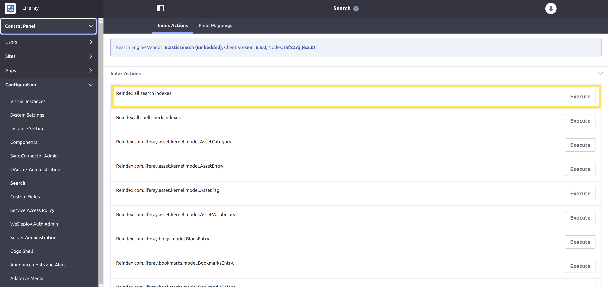

# Executing Post-Upgrade Tasks

## Review Database Configurations

Prior to upgrading your Liferay database, you tuned it for upgrade (see [Tuning for the Data Upgrade](./tuning-for-the-data-upgrade.md)). Now that the upgrade is complete, restore the production database tuning you used previously.

> **Note:** If you migrated from a sharded environment during your data upgrade, then you must make more adjustments to your configurations to complete the transition to virtual instances. See the [Upgrade and Update Properties](./upgrading-a-sharded-environment.md#Upgrade-and-Update-Properties) section for more information.

## Set Up a Search Engine and Re-index Search Indexes

Re-enable search indexing by removing the following property from `com.liferay.portal.search.configuration.IndexStatusManagerConfiguration.config`:

```properties
indexReadOnly=true
```

> **Note:** The `indexReadOnly ` value defaults to `false`, which tells Liferay to update the search indices.

> **Important:** If you have not already done so, you must also [install and configure a standalone Elasticsearch](https://help.liferay.com/hc/en-us/articles/360028711132-Installing-Elasticsearch) or [Solr](placeholder) instance to run in production. By default, Liferay DXP ships with an embedded configuration for Elasticsearch for demo purposes. This configuration is not supported in production.

Once indexing is enabled and your search engine is configured, re-index Liferay DXP's search indices. In DXP 7.2, you can do this in the UI after starting up Liferay DXP by navigating to _Control Panel_ → _Configuration_ → _Search_ and then clicking _Reindex all search indexes_.



## Enable Web Content View Permissions

Prior to DXP 7.1, all users could view Web Content articles by default. Now view permissions are checked by default instead. Here are the main options for opening view permissions:

**Option 1:** Open view permissions for all web content articles by navigating to _Control Panel_ → _Configuration_ → _System Settings_ → _Web Content_ → _Virtual Instance Scope_ → _Web Content_ and de-selecting _Article view permissions check enabled_.


**Option 2:** If not many Web Content articles exist, then edit view permissions per Web Content article per role.

## Check Web Content Images

The upgrade to DXP 7.2 moves Web Content images to the Document Library and then deletes their former table, `JournalArticleImage`. To ensure this process went smoothly, check your Web Content articles and verify that their images still show correctly.

Once you've completed all necessary post-upgrade tasks, your upgrade to Liferay DXP 7.2 is complete. Congratulations!
