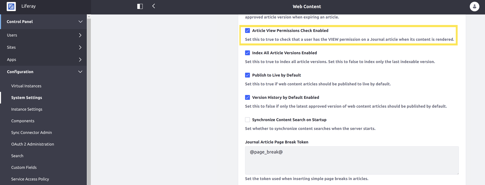

# Post-Upgrade Considerations

## Re-enable Production Settings

### Search Indexing

Before starting the upgrade process in your new installation, you must disable indexing to prevent upgrade process performance issues that arise when the indexer attempts to re-index content.

To disable indexing, create a file called `com.liferay.portal.search.configuration.IndexStatusManagerConfiguration.config` in your `[LIFERAY_HOME]/osgi/configs` folder and add the following content:

```properties
indexReadOnly="true"
```

After you complete the upgrade, re-enable indexing by removing the `.config` file or setting `indexReadOnly="false"`.

### Database Configurations

Prior to upgrading your Liferay database, you tuned it for upgrade (see [Tuning for the Data Upgrade](./tuning-for-the-data-upgrade.md)). Now that the upgrade is complete, restore the production database tuning you used previously.

```note::
   If you migrated from a sharded environment during your data upgrade, then you must make more adjustments to your configurations to complete the transition to virtual instances. See the [Upgrade and Update Properties](./upgrading-a-sharded-environment.md#Upgrade-and-Update-Properties) section for more information.
```

## Enable Web Content View Permissions

Prior to DXP 7.1, all users could view Web Content articles by default. Now view permissions are checked by default instead. Here are the main options for opening view permissions:

**Option 1:** Open view permissions for all web content articles by navigating to _Control Panel_ → _Configuration_ → _System Settings_ → _Web Content_ → _Virtual Instance Scope_ → _Web Content_ and de-selecting _Article view permissions check enabled_.



**Option 2:** If not many Web Content articles exist, then edit view permissions per Web Content article per role.

## Check Web Content Images

Upgrading to DXP 7.2 moves Web Content images to the Document Library and then deletes their former table, `JournalArticleImage`. To ensure this process went smoothly, check your Web Content articles and verify that their images still show correctly.

Once you've completed all necessary post-upgrade tasks, your Liferay DXP upgrade is complete. Congratulations!
