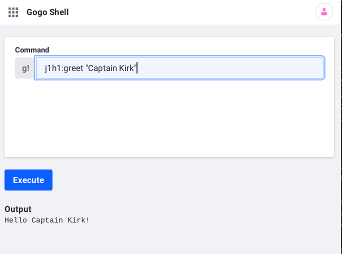

# Using an OSGi Service

Liferay APIs are readily available as OSGi services. You can access a service by creating a field of that service type and annotating the field with [`@Reference`](https://docs.osgi.org/javadoc/osgi.cmpn/7.0.0/org/osgi/service/component/annotations/Reference.html), like this:

```java
@Reference
BlogsEntryService _blogsEntryService;
```

The above `_blogsEntryService` accesses a `BlogsEntryService` OSGi service.

All Declarative Services components (classes annotated with [`@Component`](https://docs.osgi.org/javadoc/osgi.cmpn/7.0.0/org/osgi/service/component/annotations/Component.html)) can access OSGi services this way. The run time framework injects a component's `@Reference`-annotated fields with the service types they reference.

The following example demonstrates using an OSGi service called `Greeting`. Three modules demonstrate the *API-Provider-Consumer* pattern used in OSGi services.

* The **API** module defines the `Greeting` service type.
* The implementation module **provides** the `Greeting` service.
* The example module **consumes** the `Greeting` service.

The example module class creates a Gogo Shell command that uses the `Greeting` service to return a personalized greeting. Consider this example to be a "Hello World" for OSGi services.



You can use OSGi services in any Java class.

Liferay service package Javadoc is available at these locations:

* [Liferay DXP Apps](https://docs.liferay.com/dxp/apps/)
* [Liferay DXP Portal](https://docs.liferay.com/dxp/portal/7.2-latest/javadocs/)
* [Liferay CE Apps](https://docs.liferay.com/ce/apps/)
* [Liferay CE Portal](https://docs.liferay.com/ce/portal/7.2-latest/javadocs/)

```note::
   For instructions on how to create an OSGi service, please see `APIs as OSGi Services <./apis-as-osgi-services.md>`_.
```

## Deploy an Example

Start using the example.

1. Start a [Liferay Docker container](../../installation-and-upgrades/installing-liferay/using-liferay-dxp-docker-images/dxp-docker-container-basics.md).

    ```bash
    docker run -it -p 8080:8080 liferay/portal:7.3.2-ga3
    ```

1. Download and unzip `liferay-j1h1.zip`.

    ```curl
    curl https://learn.liferay.com/dxp-7.x/liferay-internals/fundamentals/liferay-j1h1.zip -O
    ```

    ```bash
    unzip liferay-j1h1.zip
    ```

1. Build the example modules.

    ```bash
    ./gradlew jar
    ```

    Each module JAR file is generated to that module's `build/libs` folder.

     ```
     j1h1-api/build/libs/com.acme.j1h1.api-1.0.0.jar
     j1h1-impl/build/libs/com.acme.j1h1.impl-1.0.0.jar
     j1h1-osgi-commands/build/libs/com.acme.j1h1.osgi.commands-1.0.0.jar
     ```

1. Deploy the example module JARs.

    API module:

    ```bash
    docker cp j1h1-api/build/libs/com.acme.j1h1.api-1.0.0.jar $(docker ps -lq):/opt/liferay/deploy
    ```

    Implementation module:

    ```bash
    docker cp j1h1-impl/build/libs/com.acme.j1h1.impl-1.0.0.jar $(docker ps -lq):/opt/liferay/deploy
    ```

    Example module:

    ```bash
    docker cp j1h1-osgi-commands/build/libs/com.acme.j1h1.osgi.commands-1.0.0.jar $(docker ps -lq):/opt/liferay/deploy
    ```

1. Confirm the deployments in the Docker container console.

    ```
    STARTED com.acme.j1h1.api_1.0.0
    STARTED com.acme.j1h1.impl_1.0.0
    STARTED com.acme.j1h1.osgi.commands_1.0.0
    ```

1. Open the [Gogo Shell](/using-the-gogo-shell/using-the-gogo-shell.md).

1. In the command field, use the `j1h1:greet` command to send a greeting.

    ```groovy
    j1h1:greet "Captain Kirk"
    ```

1. Confirm the output.

    ```
    Hello Captain Kirk!
    ```

The example module leverages the API and Implementation modules to produce the content returned from the `j1h1:greet` Gogo Shell command.

## Walk Through the Example

* [Write Your Business Logic](#write-your-business-logic)
* [Annotate External Service References](#annotate-external-service-references)
* [Make the Class a Component](#make-the-class-a-component)

### Write Your Business Logic

You can implement business logic using any OSGi services you need. The code below uses `Greeting`.

```
public void greet(String name) {
    _greeting.greet(name);
}

private Greeting _greeting;
```

The method above invokes a `Greeting` instance's `greet` method with its `name` parameter. `Greeting` is the OSGi service type that the Implementation module registers. The class must get a `Greeting` instance from the OSGi service registry.

### Annotate External Service References

Getting an OSGi service requires creating a field of the service type and adding a [`@Reference`](https://docs.osgi.org/javadoc/osgi.cmpn/7.0.0/org/osgi/service/component/annotations/Reference.html) annotation to that field.

```java
@Reference
private Greeting _greeting;
```

The `GreetingOSGiCommand` class has the above private `Greeting` field called `_greeting`. The `@Reference` annotation tells the OSGi runtime to inject the field with a `Greeting` service from the registry. If `GreetingImpl` is the only registered `Greeting` service component, the runtime injects `_greeting` with a `GreetingImpl`.

### Make the Class a Component

Only Declarative Services component can use the `@Reference` annotation. Add the `@Component` annotation to the class and declare it to implement a particular service.

```java
@Component(
	property = {"osgi.command.function=greet", "osgi.command.scope=j1h1"},
	service = Object.class
)
public class GreetingOSGiCommands {
```

The `GreetingOSGiCommand` class is a service component of type `Object`. Unless there's a particular interface or class you need to implement, making your class a service of type `Object` is fine.

```note::
   As in Java, where every class is a subclass of ``java.lang.Object`` (even though you don't need to specify it by default), in Declarative Services, the runtime must know the type of class to register. Because you're not implementing any particular type, your parent class is ``java.lang.Object``, so you must specify that class as the service. While Java doesn't require you to specify `Object` as the parent when you're creating a class that doesn't inherit anything, Declarative Services does.
```

The `GreetingOSGiCommand` class' two properties define a Gogo shell command with a command function called `greet` in a scope called `j1h1`. The deployed `GreetingOSGiCommand` component provides the Gogo Shell command `j1h1:greet` that takes a `String` as input.

## Conclusion

The API and Impl modules created the service and the example module used the service to create a simple Gogo Shell command. The API-Provider-Consumer contract fosters loose coupling, making your software easy to manage, enhance, and support.

Now that you're familiar with creating and using OSGi services, you can explore using OSGi services from other modules. [Configuring Dependencies](./configuring-dependencies/configuring-dependencies.md) demonstrates finding modules and configuring them as dependencies.

## Additional Information

* [Importing Packages](./importing-packages.md)
* [Exporting Packages](./exporting-packages.md)
* [Semantic Versionings](./semantic-versioning.md)