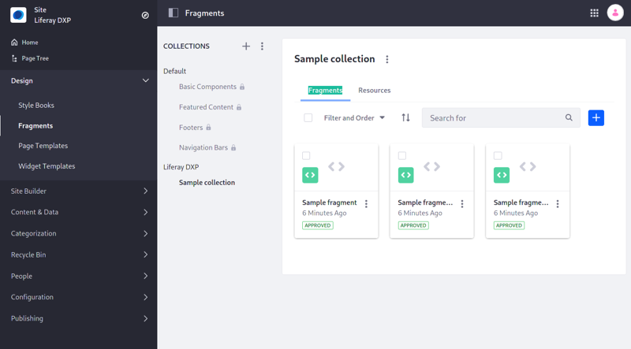
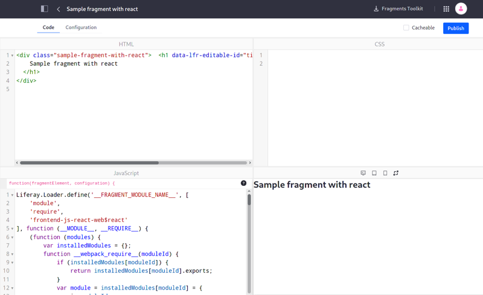

# Using the Fragments Toolkit

The Fragments Toolkit helps you develop and manage Fragments locally, using your favorite tools. Here you'll use the toolkit to import an example Fragment Collection and to create and import your own Fragment Collection.

## Import a Fragment Collection

First, import an example Fragment Collection to see what one looks like:

1. Run the command below to start the Docker container:

    ```bash
    docker run -it -p 8080:8080 [$LIFERAY_LEARN_DXP_DOCKER_IMAGE$]
    ```

1. Download and unzip the [example](https://learn.liferay.com/dxp/7.x/en/site-building/developer-guide/developing-page-fragments/liferay-x2y6.zip)

    ```bash
    curl https://learn.liferay.com/dxp/7.x/en/site-building/developer-guide/developing-page-fragments/liferay-x2y6.zip -O
    ```

    ```bash
    unzip liferay-x2y6.zip -d liferay-x2y6
    ```

1. Set up the Fragments Toolkit for the tutorial:

    ```bash
    cd liferay-x2y6
    ```

    ```bash
    ./setup_tutorial.sh
    ```

    Resolve all unmet requirements reported by the script and rerun the script until it reports that your environment is ready.

1. Import the Fragment Collection in the Docker container with the Fragments Toolkit using the `npm run import` command below. Alternatively, you can [import the Fragment Collection manually](../../displaying-content/using-fragments/managing-page-fragments.md).

    ```bash
    npm run import
    ? Liferay host & port (http://localhost:8080)
    ? Username (test@liferay.com)
    ? Password [hidden]

    Checking connection...
    Connection successful

    ? Company ID liferay.com
    ? Group ID Liferay
    Building project...
    Importing project...
    ✔ Fragment X2Y6 Card imported
    Project imported
    ```

1. Verify that the Fragment Collection is available. Point your browser to `https://localhost:8080`, and under the Site Menu on the left side of the screen, go to *Design* &rarr; *Fragments*. The Collection appears in the Collection list.

    

    ```note::
       For Liferay DXP 7.1 and 7.2, instead navigate to *Site* → *Site Builder* → *Page Fragments* under the Product Menu to get to the *Fragments* page.
    ```

Great! You successfully deployed a Fragment Collection.

## Collection Format Overview

Fragment Collections use this project structure:

* `collection.json`: a text file that describes the Collection.

    ```json 
    {
        "description": "Optional description",
        "name": "Collection name"
    }
    ```

* `language.properties` (optional): language keys defined for the Collection.

* `[fragment-name]/`: a folder containing all of the files for a Fragment.

    * `configuration.json`(optional): a JSON file that defines the Fragment's configuration. See [Adding Configuration Options to Fragments](./adding-configuration-options-to-fragments.md) for more information.

    * `fragment.json`: a text file that describes the Fragment.

        ```json
        {
            "configurationPath": "configuration.json",
            "cssPath": "styles.css",
            "htmlPath": "index.html",
            "jsPath": "main.js",
            "name": "Fragment name",
            "thumbnailPath": "thumbnail.png",
            "type": "[component|react]"
        }
        ```

      Update the `*Path` properties with the names of your CSS, configuration, HTML, and JavaScript files.

    * `index.html`: the HTML source for the Fragment.

    * `main.js`: the JavaScript source for the Fragment.

    * `styles.css`: the CSS source for the Fragment.

    * `thumbnail.png` (optional): an image that's displayed when the fragment is in a list.

* `resources/` (optional): a folder containing any additional images or files the Fragments need. See [Including Default Resources in Fragments](./including-default-resources-with-fragments.md) for more information.

The Fragments Toolkit facilitates creating Fragment Collections.
 
## Add a New Collection and Fragment

The example's `package.json` file provides the Fragments Toolkit. Follow these steps to add a new Fragment Collection and a new Fragment:

1. Set up the Fragments Toolkit if you haven't done so already.

    ```bash
    cd liferay-x2y6
    ```

    ```bash
    ./setup_tutorial.sh 
    ```

1. Create a Fragment Collection with the `npm run add-collection` command and answer the prompts with your Collection's name and an optional description:

    ```bash
    npm run add-collection

    > x2y6@ add-collection /home/jhinkey/examples/liferay-x2y6
    > yo liferay-fragments:collection

    ? Collection name (required) My Collection
    ? Collection description (optional) This is my new Fragment Collection.
       create src/my-collection/collection.json
    ```

    Resulting `collection.json` file:

    ```json
    {
        "description": "This is my new Fragment Collection.",
        "name": "My Collection"
    }
    ```

1. In the Collection's folder, create a Fragment:

    ```bash
    cd src/my-collection 
    ```

    ```bash
    npm run add-fragment
    ```

    The CLI starts the process:

    ```bash
    > x2y6@ add-fragment ~/liferay-x2y6
    > yo liferay-fragments:fragment
    ```

1. Name your Fragment.

    ```bash
    ? Fragment name (required) My Jumbotron
    ```

    
1. Here you can choose whether to use React to process fragment JavaScript before importing the fragment to Liferay. This option requires Liferay 7.3+. If you're using Liferay version 7.2 or below, decline using React. For the purpose of this tutorial, please decline using React.

    ```bash
    ? Use React (or other JS framework)? No
    ```

1. Since you declined using React, the toolkit asks whether you want to use the new editable element syntax. This is available for Liferay 7.3+. If you're using Liferay version 7.2 or below, please decline using the new syntax.

    ```bash
    ? Use new data-lfr editable syntax? Yes
    ```

    ```note::
       If you accepted using React in your fragment, the toolkit assumes you're on Liferay 7.3+ and configures the new editable element syntax.
    ```

    ```note::
       Please see `Fragment-Specific Tags <../reference/fragments/fragment-specific-tags-reference.md>`_ for more information on Liferay's editable data syntax.
    ```

1. Select the Collection you just created (`My Collection`).

    ```bash
    ? Choose a collection (my-collection)
       create src/my-collection/my-jumbotron/index.html
       create src/my-collection/my-jumbotron/main.js
       create src/my-collection/my-jumbotron/styles.css
       create src/my-collection/my-jumbotron/fragment.json
       create src/my-collection/my-jumbotron/configuration.json
    ```

    ```note::
        The ``fragment.json`` defines the paths to the Fragment's CSS, HTML, and JavaScript. If you change any of these file names, update their paths in the ``fragment.json``.
    ```

1. Write the Fragment's HTML (`index.html`), CSS (`styles.css`), JavaScript (`main.js`), and any [configuration options](./adding-configuration-options-to-fragments.md) (`configuration.json`).

Here's the generated Fragment HTML that uses the new `data-lfr` editable syntax:

```html
<div class="my-jumbotron">
    <h1 data-lfr-editable-id="title" data-lfr-editable-type="text">
        My Jumbotron
    </h1>
</div>
```

You can build off of the above HTML and use [Clay](https://clayui.com/)'s [Bootstrap](https://getbootstrap.com/)-based components to create Fragment HTML like this:

```html
<div class="component-x276-my-jumbotron">
    <div class="jumbotron">
        <h1
            class="display-4"
            data-lfr-editable-id="01-title"
            data-lfr-editable-type="rich-text"
        >
            Editable Jumbotron Headline
        </h1>

        <p
            class="lead"
            data-lfr-editable-id="02-lead"
            data-lfr-editable-type="rich-text"
        >
            Edit this text to call extra attention to featured content or information.
        </p>

        <hr />

        <p
            data-lfr-editable-id="03-text"
            data-lfr-editable-type="rich-text"
        >
            Edit this text to provide more information.
        </p>

        <a
            class="btn btn-primary btn-lg"
            data-lfr-editable-id="04-label"
            data-lfr-editable-type="link"
            href="#"
        >
            Editable Link
        </a>
    </div>
</div>
```

```note::
   If you are using Liferay 7.2 or below, remove the ``data-lfr-editable-[id|type]`` attributes and wrap the content elements in ``lfr-editable`` elements as described in `Fragment-Specific Tags <../reference/fragments/fragment-specific-tags-reference.md>`_.
```

The first `div` element's `class="component-x276-my-jumbotron"` attribute attempts to uniquely identify this Fragment on a page. 

```tip::
  In your Fragment's HTML file, use the main wrapper element (the ``<div>`` in the example above) to uniquely identify the Fragment so it doesn't conflict with other components on a page.
```

Next the `<div class="jumbotron"/>` element wraps the content, applying [Bootstrap](https://getbootstrap.com/)'s jumbotron component. This component makes the content stand out. Here are the content elements:

* `<h1 class="display-4" ...>Editable Jumbotron ...` creates the Fragment's heading. It uses [Bootstrap](https://getbootstrap.com/)'s `display-4` size style. The `data-lfr-editable-` attributes make the heading text [editable](../reference/fragments/fragment-specific-tags-reference.md). The `data-lfr-editable-id="03-text"` attribute identifies the element and the `data-lfr-editable-type="rich-text"` attribute declares the content type.
* `<p class="lead" ...>Edit this text ...` is the lead body text distinguished by Clay's [`lead`](https://clayui.com/docs/css/content/typography.html#css-lead) style component. The `data-lfr-editable-` attributes make the paragraph editable.
* The `<hr/>` and next `<p ...` elements produce a horizontal rule and another editable paragraph, respectively.
* `<a class="btn btn-primary btn-lg" ...` specifies a modifiable link. The `btn-primary` class styles it as a main button and `btn-lg` makes it large. The `href="#"` attribute takes the user to the top of the page when the link is clicked. The `data-lfr-editable-type="link"` attribute makes the link [editable](../reference/fragments/fragment-specific-tags-reference.md).

You can also include resources in your Fragments. See [Including Default Resources in Fragments](./including-default-resources-with-fragments.md) for more information.

```note::
  The Fragment and configuration object are passed in as arguments in JavaScript and are available as ``fragmentElement`` and ``configuration`` parameters, respectively.
```

## Import and Test

You can import your new Fragment as you did the original example Fragment:

1. Run the import command and provide your credentials:

    ```bash
    npm run import
    ```

1. Verify that the new Fragment Collection is available. Point your browser to `https://localhost:8080`, and under the Site Menu on the left side of the screen, go to *Design* &rarr; *Fragments*. The Collection appears in the Collection list.



Great! Now you know how to use the Fragments Toolkit to create and manage Fragments. See the [Fragments Toolkit Command Reference](../reference/fragments/fragments-toolkit-command-reference.md) for more toolkit command information.

## Related Information

* [Creating a Contributed Fragment Collection](./creating-a-contributed-fragment-collection.md)
* [Using the Fragments Editor](./using-the-fragments-editor.md)
* [Fragments Toolkit Command Reference](../reference/fragments/fragments-toolkit-command-reference.md)