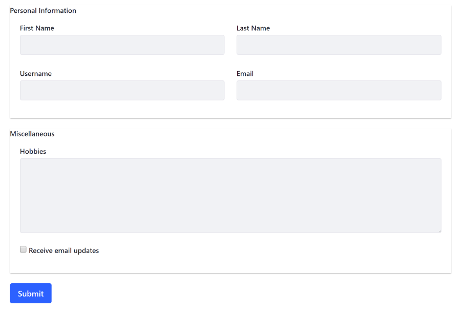
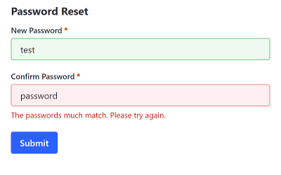

# Building Forms with AUI Tags

The [AUI tag library](https://docs.liferay.com/portal/7.2-latest/taglibs/util-taglib/aui/tld-summary.html) provides all the components you need to build forms for your applications. AUI tags provide many benefits to standard form elements, such as custom namespacing, localization, and even validation. They provide multiple attributes that let you create the experience you want for your users. 

Follow these steps to build a form using AUI tags:

1. Add the `aui` taglib declaration to your portlet's `view.jsp` if you haven't  already:

    ```markup
    <%@ taglib prefix="aui" uri="http://liferay.com/tld/aui" %>
    ```

1. Build your form using the tags shown below. Each tag links to the corresponding taglibdoc that list the available attributes:

    * [`<aui:input>`](https://docs.liferay.com/ce/portal/7.2-latest/taglibs/util-taglib/aui/input.html)
    * [`<aui:button>`](https://docs.liferay.com/ce/portal/7.2-latest/taglibs/util-taglib/aui/button.html)
    * [`<aui:button-row>`](https://docs.liferay.com/ce/portal/7.2-latest/taglibs/util-taglib/aui/button-row.html)
    * [`<aui:container>`](https://docs.liferay.com/ce/portal/7.2-latest/taglibs/util-taglib/aui/container.html)
    * [`<aui:col>`](https://docs.liferay.com/ce/portal/7.2-latest/taglibs/util-taglib/aui/col.html)
    * [`<aui:row>`](https://docs.liferay.com/ce/portal/7.2-latest/taglibs/util-taglib/aui/row.html)
    * [`<aui:field-wrapper>`](https://docs.liferay.com/ce/portal/7.2-latest/taglibs/util-taglib/aui/field-wrapper.html)
    * [`<aui:fieldset>`](https://docs.liferay.com/ce/portal/7.2-latest/taglibs/util-taglib/aui/fieldset.html)
    * [`<aui:fieldset-group>`](https://docs.liferay.com/ce/portal/7.2-latest/taglibs/util-taglib/aui/fieldset-group.html)
    * [`<aui:form>`](https://docs.liferay.com/ce/portal/7.2-latest/taglibs/util-taglib/aui/form.html)
    * [`<aui:select>`](https://docs.liferay.com/ce/portal/7.2-latest/taglibs/util-taglib/aui/select.html)
    * [`<aui:option>`](https://docs.liferay.com/ce/portal/7.2-latest/taglibs/util-taglib/aui/option.html)

    An example form is shown below:

    ```markup
    <aui:form name="fm">
    	<aui:fieldset-group markupView="lexicon">
    		<aui:fieldset label="Personal Information">
    			<aui:row>
    				<aui:col width="50">
    					<aui:input label="First Name" name="firstName" type="text" />
    				</aui:col>
    				<aui:col width="50">
    					<aui:input label="Last Name" name="lastName" type="text" />
    				</aui:col>
    			</aui:row>
    			<aui:row>
    				<aui:col width="50">
    					<aui:input label="Username" name="username" type="text" />
    				</aui:col>
    				<aui:col width="50">
    					<aui:input label="Email" name="email" type="email" />
    				</aui:col>
    			</aui:row>
    		</aui:fieldset>
    	</aui:fieldset-group>
    	<aui:fieldset-group markupView="lexicon">
    		<aui:fieldset label="Miscellaneous">
    			<aui:input label="Hobbies" name="hobbies" type="textarea" />
    			<aui:input label="Receive email updates" name="emailUpdates" type="checkbox" />
    		</aui:fieldset>
    	</aui:fieldset-group>
    	<aui:button-row>
    		<aui:button name="submitButton" type="submit" value="Submit" />
    	</aui:button-row>
    </aui:form>
    ```

    

1. Optionally add validation to your form fields. Nest a `<aui:validator>` tag inside each form field that you want to validate. Specify the validation rule with the `<aui:validator>` tag's `name` attribute (The available validation rules are shown in the table below). You can override a field's default validation error message with the `errorMessage` attribute. An  example configuration is shown below:

    ```markup
    <aui:form name="myForm">
        <aui:input name="password" id="password" label="Password" 
        required="true" />
        <aui:input name="confirmPassword" id="password" 
        label="Confirm Password" required="true">
            <aui:validator name="equalTo" 
            errorMessage="The passwords much match. Please try again." >
            '#<portlet:namespace>password'
            </aui:validator>
        </aui:input>
    </aui:form>
    ```

    

    The full list of available validation rules is shown in the table below:

| Rule | Description | Default Error Message |
| --- | --- | --- |
| `acceptFiles` | Specifies that the field can only contain the file types given. Each file extension must be separated by a comma. For example </br> `<aui:validator name="acceptFiles">'jpg,png,tif,gif'</aui:validator>` | 'Please enter a file with a valid extension ([supported extensions]).' |
| `alpha` | Permits alphabetic characters | 'Please enter only alpha characters.' |
| `alphanum` | Permits alphanumeric characters | 'Please enter only alphanumeric characters.' |
| `date` | Permits dates | 'Please enter a valid date.' |
| `digits` | Permits digits | 'Please enter only digits.' |
| `email` | Permits an email address | 'Please enter a valid email address.' |
| `equalTo` | Permits contents equal to another field with the specified field ID. For example, </br> `<aui:validator name="equalTo">'#<portlet:namespace/>password'</aui:validator>` | 'Please enter the same value again.' |
| `max` | Permits an integer value less than the specified value. For example, a max value of 20 is specified with </br> `<aui:validator name="max">20</aui:validator>` | 'Please enter a value less than or equal to [max value].' |
| `maxLength` | Permits a maximum field length of the specified size (follows the same syntax as `max`) | 'Please enter no more than [max] characters.' |
| `min` | Permits an integer value greater than the specified minimum value (follows the same syntax as `max`) | 'Please enter a value greater than or equal to [min value].' |
| `minLength` | Permits a field length longer than the specified size (follows the same syntax as `max`). | 'Please enter at least [min] characters.' |
| `number` | Permits numerical values | 'Please enter a valid number.' |
| `range` | Permits a number between the specified range. For example, a range between 1.23 and 10 is specified here </br> `<aui:validator name="range">[1.23,10]</aui:validator>` | 'Please enter a value between [0] and [1].' |
| `rangeLength` | Permits a field length between the specified range (follows the same syntax as `range`)  | 'Please enter a value between [0] and [1] characters long.' |
| `required` | Prevents a blank field  | 'This field is required.' |
| `url` | Permits a URL value | 'Please enter a valid URL.' |

Now you know how to build user-friendly forms for your applications.

## Related Topics

* [Using the Chart Taglib in Your Portlets](https://help.liferay.com/hc/en-us/articles/360028832592-Using-the-Chart-Taglib-in-Your-Portlets)
* [Using Liferay Front-end Taglibs in Your Portlet](https://help.liferay.com/hc/en-us/articles/360028832272-Using-Liferay-Front-end-Taglibs-in-Your-Portlet)
* [Using the Clay Taglib in Your portlets](https://help.liferay.com/hc/en-us/articles/360029145411-Using-the-Clay-Taglib-in-Your-portlets)