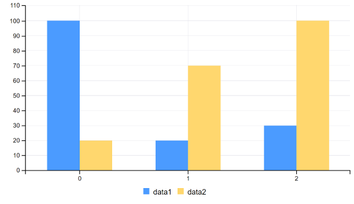

# Bar Charts

Bar charts contain multiple sets of data. A bar chart models the data in bars. Each data series (created with the `addColumns()` method) is defined with a new instance of the [`MultiValueColumn` object](https://docs.liferay.com/ce/apps/frontend-taglib/latest/javadocs/com/liferay/frontend/taglib/chart/model/MultiValueColumn.html), which takes an ID and a set of values. Follow these steps to configure your portlet to use bar charts. 

1. Import the chart taglib along with the `BarChartConfig` and `MultiValueColumn` classes into your bundle's `init.jsp` file:

    ```markup
    <%@ taglib prefix="chart" uri="http://liferay.com/tld/chart" %>
    <%@ page import="com.liferay.frontend.taglib.chart.model.point.bar.BarChartConfig" %>
    <%@ page import="com.liferay.frontend.taglib.chart.model.MultiValueColumn" %>
    ```

1. Add the following Java scriptlet to the top of your `view.jsp`:

    ```java
    <%
    BarChartConfig _barChartConfig = new BarChartConfig();

    _barChartConfig.addColumns(
    	new MultiValueColumn("data1", 100, 20, 30),
    	new MultiValueColumn("data2", 20, 70, 100)
    );

    %>
    ```

1. Add the `<chart>` taglib to the `view.jsp`, passing the `_barChartConfig` as the `config` attribute's value:

    ```markup
    <chart:bar
      config="<%= _barChartConfig %>"
    />
    ```



Awesome! Now you know how to create bar charts for your apps. 

## Related Topics

* [Line Charts](./line-chart.md)
* [Scatter Charts](./scatter-chart.md)
* [Spline Charts](./spline-chart.md)