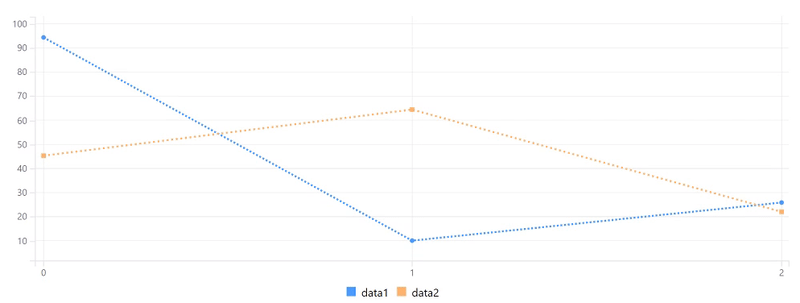

# Refreshing Charts to Reflect Real Time Data

The polling interval property is an optional property for all charts. It specifies the time in milliseconds for the chart's data to refresh. You can use this for charts that receive any kind of real time data, such as a JSON file that changes periodically. This ensures that the chart is up to date, reflecting the most recent data. Follow these steps to configure your chart to use real  time data. 

1. Add a new java scriptlet and create a new instance of the chart's object, and put the data into the `data` attribute. Finally, set the chart's polling interval with the `setPollingInterval()` method. An example `view.jsp` configuration is shown below:

		```java
		<%
		LineChartConfig _pollingIntervalLineChartConfig = new LineChartConfig();

		_pollingIntervalLineChartConfig.put("data", "/foo.json");

		_pollingIntervalLineChartConfig.setPollingInterval(2000);

		%>
		```

1. Set the chart taglib's `config` attribute to the updated configuration object that you created in the last step, as shown in the example below:

		```jsp
		<chart:line
			componentId="polling-interval-line-chart"
			config="<%= _pollingIntervalLineChartConfig %>"
		/>
		```



Now you know how to reflect real time data in your charts! 

## Related Topics

* [Combination Charts](./combination-chart.md)
* [Geomap Charts](./geomap-chart.md)
* [Scatter Charts](./scatter-chart.md)