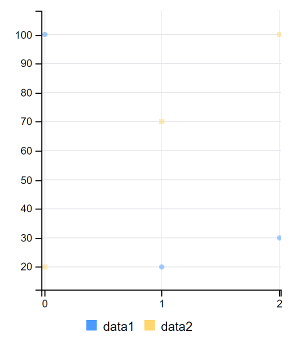

# Scatter Charts

Scatter charts contain multiple sets of data. A scatter chart models the data as individual points. Each data series (created with the `addColumns()` method) is defined with a new instance of the  [`MultiValueColumn` object](https://docs.liferay.com/ce/apps/frontend-taglib/latest/javadocs/com/liferay/frontend/taglib/chart/model/MultiValueColumn.html), which takes an ID and a set of values. Follow these steps to configure your portlet to use scatter charts. 

1. Import the chart taglib along with the `ScatterChartConfig` and `MultiValueColumn` classes into your bundle's `init.jsp` file:

    ```markup
    <%@ taglib prefix="chart" uri="http://liferay.com/tld/chart" %>
    <%@ page import="com.liferay.frontend.taglib.chart.model.point.scatter.ScatterChartConfig" %>
    <%@ page import="com.liferay.frontend.taglib.chart.model.MultiValueColumn" %>
    ```

1. Add the following Java scriptlet to the top of your `view.jsp`:

    ```java
    <%
    ScatterChartConfig _scatterChartConfig = new ScatterChartConfig();

    _scatterChartConfig.addColumns(
      new MultiValueColumn("data1", 100, 20, 30),
      new MultiValueColumn("data2", 20, 70, 100));
    }
    %>
    ```

1. Add the `<chart>` taglib to the `view.jsp`, passing the `_scatterChartConfig` as the `config` attribute's value:

    ```markup
    <chart:scatter
      config="<%= _scatterChartConfig %>"
    />
    ```



Awesome! Now you know how to create scatter charts for your apps. 

## Related Topics

* [Step Charts](./step-chart.md)
* [Line Charts](./line-chart.md)
* [Spline Charts](./spline-chart.md)