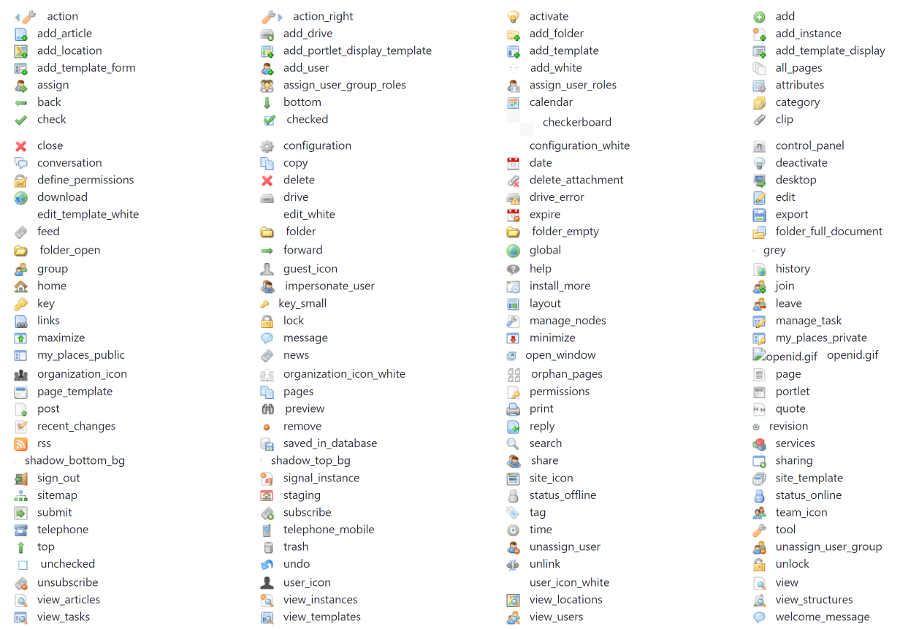

# Liferay UI Icons

The Liferay UI taglibs provide several icons you can include in your apps. To add an icon to your app, use the `liferay-ui:icon` tag and specify the icon with either the `icon`, `iconCssClass`, or `image` attribute. An example of each use case is shown below. 

The `image` attribute specifies [Liferay UI icons](https://github.com/liferay/liferay-portal/tree/7.2.x/modules/apps/frontend-theme/frontend-theme-unstyled/src/main/resources/META-INF/resources/_unstyled/images) to use (as defined in the Unstyled theme's `images/common` folder). Here's an example configuration for a JSP:

```markup
<div class="col-md-3">
	<liferay-ui:icon image="subscribe" />

	<span class="ml-2">Subscribe</span>
</div>
```


The Liferay UI taglib also exposes language flag icons. To use a language flag icon, provide the `../language/` relative path before the icon's name. Below is an example snippet from the Web Content Search portlet that displays the current language's flag along with a localized message:

```markup
<liferay-ui:icon
    image='<%= "../language/" + languageId %>'
    message='<%= LanguageUtil.format(
        request,
        "this-result-comes-from-the-x-version-of-this-content",
        snippetLocale.getDisplayLanguage(locale),
        false
    ) %>'
/>
```

You can achieve the same result in FreeMarker with the following code that uses the available [`init.ftl` variables](https://github.com/liferay/liferay-portal/blob/7.2.x/modules/appsfrontend-theme/frontend-theme-unstyled/src/main/resources/META-INF/resources/_unstyled/templates/init.ftl) and [Liferay DXP macros](/docs/7-2/reference/-/knowledge_base/r/product-freemarker-macros):

```markup
<#assign flag_message>
    <@liferay.language_format 
        arguments=language 
        key="this-result-comes-from-the-x-version-of-this-content" 
    />
</#assign>

<@liferay_ui["icon"]
    image="../language/${language_id}"
    message=flag_message
/>
```

The full list of available icons is shown in the figures below:




The `icon` attribute specifies  [Font Awesome icons](https://fontawesome.com/v3.2.1/icons/)  to use:

```markup
<liferay-ui:icon icon="angle-down" />
```


The `iconCssClass` attribute specifies a [glyphicon](http://marcoceppi.github.io/bootstrap-glyphicons/) to use:

```markup
<liferay-ui:icon
    iconCssClass="icon-remove-sign"
    label="<%= true %>"
    message="unsubscribe"
    url="<%= unsubscribeURL %>"
/>
```


The examples above use some of the icon's available attributes. See the [Icon taglibdocs](https://docs.liferay.com/dxp/portal/7.2-latest/taglibs/util-taglib/liferay-ui/icon.html) for the full list. 

## Related Topics

- [Clay Icons](../clay-tag-library/clay-icons.md)
- [Liferay UI Icon Lists](./liferay-ui-icon-lists.md)
- [Liferay UI Icon Menus](./liferay-ui-icon-menus.md)