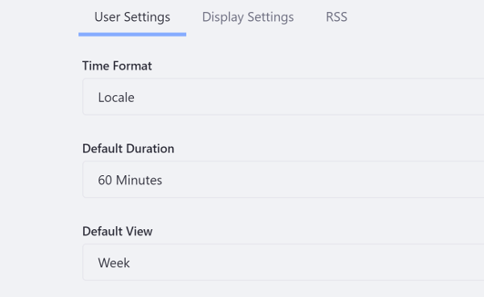

# Liferay UI Tabs

Tabs create dividers that organize content into individual sections. Content can be embedded or included from another JSP. 

To add tabs to your app, use the `<liferay-ui:tabs>` tag and specify each tab's name as a comma-separated list for the `names` attribute. For example, three tabs named `tab1`, `tab2`, and `tab3`, look like this in the JSP:

```markup
<liferay-ui:tabs names="tab1,tab2,tab3">

</liferay-ui:tabs>
```

Each tab requires a corresponding section to display content. Nest `liferay-ui:section` tags for each of the tabs. Within each section, you can add HTML content or add content indirectly by including content from another JSP (via the `<%@ includefile="filepath"%>` directive). The example snippet below is from the Calendar portlet's `configuration.jsp`:

```markup
<liferay-ui:tabs
    names='<%= "user-settings,display-settings,rss" %>'
    param="tabs2"
    refresh="<%= false %>"
    type="tabs nav-tabs-default"
>
    <liferay-ui:section>
        <%@ include file="/configuration/user_settings.jspf" %>
    </liferay-ui:section>

    <liferay-ui:section>
        <%@ include file="/configuration/display_settings.jspf" %>
    </liferay-ui:section>

    <liferay-ui:section>
        <%@ include file="/configuration/rss.jspf" %>
    </liferay-ui:section>
</liferay-ui:tabs>
```



The example above uses some of the tab's available attributes. See the [Tabs taglibdocs](https://docs.liferay.com/dxp/portal/7.2-latest/taglibs/util-taglib/liferay-ui/tabs.html) for the full list of attributes. 

## Related Topics

* [Clay Navigation Bars](../clay-tag-library/clay-navigation-bars.md)
* [Clay Dropdown Menus and Action Menus](../clay-tag-library/clay-dropdown-and-action-menus.md)
* [Liferay UI Icon Help](./liferay-ui-icon-help.md)