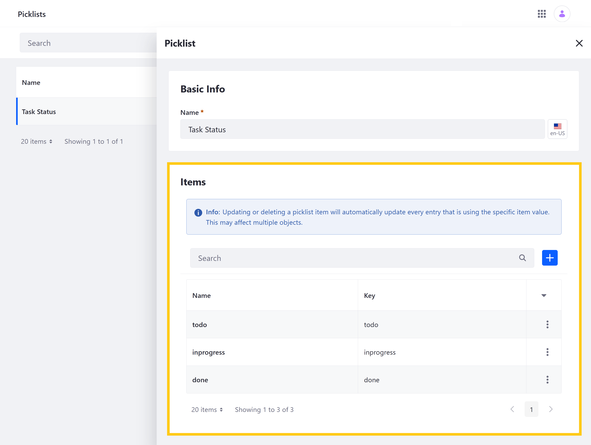

# Using Objects to Create Kanban Boards

With Liferay Objects, you can build and extend applications without needing to develop code or deploy modules. The following tutorial demonstrates how to create a basic kanban solution using Liferay Objects, Forms, and fragments.

First, you'll [add a Picklist](#adding-a-task-status-picklist) for defining kanban states. Then, you'll [create an Object](#creating-an-object-for-the-kanban-tasks) for receiving and storing task entries. After [adding data](#adding-task-entries) to the Object, you'll [build a task display Page](#building-a-page-for-displaying-tasks) using the provided fragment. Finally, you'll [build a Page for adding tasks](#building-a-page-for-adding-tasks) to enable more users to create Task entries.


## Preparing Tutorial Resources

Before proceeding with the tutorial, start up a clean Liferay Docker container and import the provided kanban fragment. Also, to use the provided fragment, you must enable JQuery and automatic propagation for Page fragments under System Settings. Once configured, you can [begin](#adding-a-task-status-picklist) creating your kanban solution.

### Liferay Docker Container

Run the following command to start up a new Liferay DXP 7.4 container:

```docker
docker run -it -m 8g -p 8080:8080 [$LIFERAY_LEARN_DXP_DOCKER_IMAGE$]
```

### Adding the Kanban Fragment

Follow these steps to add the Kanban Task fragment to your new DXP instance:

1. Download the provided `zip` file.

   ```bash
   curl https://learn.liferay.com/dxp/latest/en/building-applications/objects/building-solutions-with-objects/liferay-q3r7.zip -O
   ```

1. Navigate to the default *Liferay DXP* Site, open the *Site Menu* ( , and go to *Design* &rarr; *Fragments*.

1. Click the *Actions* button () for Collections and select *Import*.

   

1. Select the provided zip file and click *Import*.

This creates a new fragment category called *Q3R7 Collection*, which includes the *Kanban Task* fragment.

   

### Enabling JQuery

Follow these steps to enable JQuery:

1. Open the *Global Menu* (), click on the *Control Panel* tab, and go to *System Settings* &rarr; *Third Party* &rarr; *JQuery*.

1. Check *Enable JQuery*.

1. Click *Update*.

   

### Enabling Automatic Propagation

Follow these steps to enable automatic propagation for fragment changes:

1. Open the *Global Menu* (), click on the *Control Panel* tab, and go to *System Settings* &rarr; *Page Fragments*.

1. Check *Propagate Fragment Changes Automatically*.

1. Click *Update*.

   

## Adding a Task Status Picklist

Follow these steps to create a Picklist for task statuses:

1. Open the *Global Menu* (), click on the *Control Panel* tab, and go to *Picklists*.

1. Click the *Add* button (), enter *Task Status* for its name, and click *Save*.

1. Select the new *Picklist* and add the following *Items*.

   | Name | Key |
   | --- | --- |
   | todo | todo |
   | inprogress | inprogress |
   | done | done |

   

After creating the Picklist, you can create an Object that uses this list to set a task's kanban state.

## Creating an Object for the Kanban Tasks

Follow these steps to create an Object for receiving and storing kanban tasks:

1. Open the *Global Menu* (), click on the *Control Panel* tab, and go to *Objects*.

1. Click the *Add* button (  ) and enter these values.

   | Field | Value |
   | --- | --- |
   | Label | Task |
   | Plural Label | Tasks |
   | Object Name | Task |

1. Select the *Object*, click on the *Field* tab, and add these four *fields*.

   | Label | Field Name | Type | Picklist | Required |
   | --- | --- | --- | --- | --- |
   | Task Title | taskTitle | String | n/a | &#10004; |
   | Description | description | String | n/a |  |
   | Task Status | taskStatus | Picklist | Task Status | &#10004; |
   | Progress | progress | Integer | n/a |  |

   

1. Click on the *Details* tab and set the following Entry Display and Scope settings.

   | Field | Value |
   | --- | --- |
   | Title Field | Task Title |
   | Scope | Site |
   | Panel Category Key | Site Administration > People |

   

1. Click *Publish*.

[Publishing an Object](../creating-and-managing-objects/creating-objects.md#publishing-object-drafts) creates and activates the application with its database columns. This also creates a collection provider for displaying the Object's entries using the Collection Display fragment.

Once Published, you can access the Object and [add task entries](#adding-task-entries) via the Liferay UI or Headless APIs.

## Adding Task Entries

Follow these steps to add task entries to your newly published Object via the Liferay UI:

1. Navigate to the default *Liferay DXP* Site, open the *Site Menu* (  ), and go to *People* &rarr; *Tasks*.

1. Use the *Add* button (  ) to create task entries.

   Due to limitations in the provided kanban fragment, you'll need at least one task for each Task Status.

   

After adding task entries, you can [build a Page](#building-a-page-for-displaying-tasks) for displaying them.

## Building a Page for Displaying Tasks

Follow these steps to create a kanban board Page:

1. Navigate to the default *Liferay DXP* Site and create a Content Page named *Tasks*.

1. Add a *Container* fragment to the Page.

1. Add a *Grid* fragment to the container and set the Overflow setting to *Visible*. This ensures the fragment's actions menu is fully visible.

1. Add *Heading* fragments to each grid module for each Task Status: *To Do*, *In Progress*, and *Done*.

1. Add a *Collection Display* fragment to each grid module and select the *Tasks* Collection Provider for each fragment.

1. Filter each Collection Display fragment to display only one Task Status, *todo*, *inprogress*, and *done* respectively.

   

1. Drag and drop the *Kanban Task* fragment onto each Collection Display fragment.

   

1. Map the *Kanban Task fields* to their corresponding *Object fields*.

   

1. Click *Publish*.

Now users can view and manage Task entries via the Tasks Page.


## Building a Page for Adding Tasks

Since not all users can access the Site Menu, you can create an Add Task page to give more users the ability to create tasks. To create this page, you'll leverage the Object's Forms integration.

### Creating a Form for Adding Tasks

Follow these steps to create a form for adding task entries:

1. Open the *Site Menu* (), and go to *Content & Data* &rarr; *Forms*.

1. Click the *Add* button to create a new form.

1. Click the *Configuration* button (), set its storage type to *Object*, and select the *Task* Object.

1. Name the form *Add Task*.

1. Add the following form elements and map them to their corresponding Object fields.

   To map them, click the desired field element, go to the *Advanced* tab, and select the desired *Object Field*. See [Mapping Form Fields to Object Fields](../using-forms-with-objects.md#mapping-form-fields-to-object-fields) for more information.

   | Form Element | Object Field |
   | --- | --- |
   | Text | Task Title |
   | Text | Description |
   | Numeric | Progress |
   | Select from List | Task Status |

   

1. Click *Publish*.

Once the form is created, you can add it to a Page using the Form widget.

### Creating an Add Tasks Page

Follow these steps to build a Page for adding task entries:

1. Under *Tasks*, create a blank child Page named *Add Task*.

1. Add the *Form* widget to the Page.

1. Click the Widget's *Options* button and select *Configuration*.

   

1. Select the *Add Task* form.

1. Click *Save*.

Now all users with access to the Add Task page can add Task entries.


To provide easy access to your new page, you can add an *Add Task* button to the Tasks Page.

### Adding an Add Task Button

Follow these steps to add an Add Task button to the Tasks Page:

1. Navigate to the Tasks Page and click the Edit button ().

1. Drag and drop a *Button* fragment into the Container fragment.

1. Select the Button's link element and change it's text to *Add Task*.

1. In the *Link* tab, add `/add-task` to the URL field.

1. Click *Publish*.

Users can now click the button to access the Add Task page.

   

## Additional Information

* [Creating Objects](../creating-and-managing-objects/creating-objects.md)
* [Using Picklists](../using-picklists.md)
* [Using Forms with Objects](../using-forms-with-objects.md)
