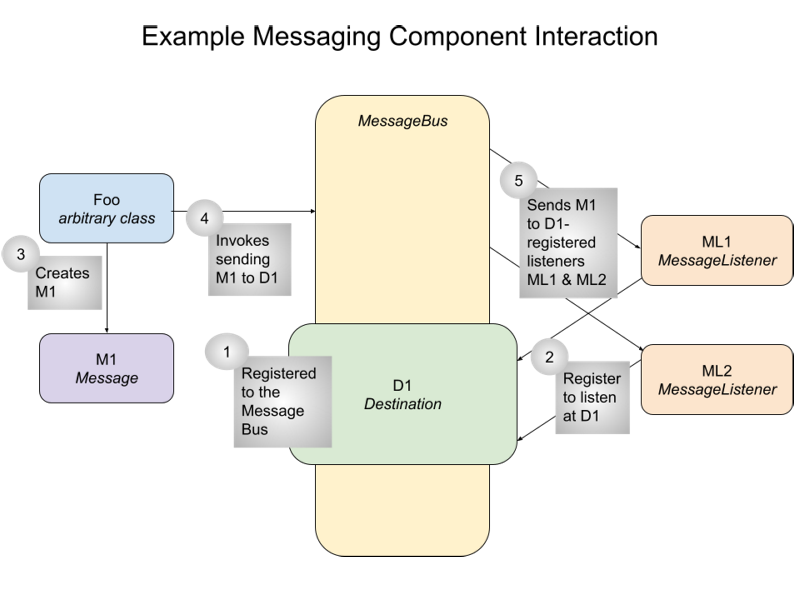

# Message Bus

The Message Bus facilitates exchanging messages while keeping sender and receiver concerns separate. Sender classes invoke the Message Bus to send messages to destinations, while *listener* classes receive messages sent to destinations; listeners are transparent to senders and vice-versa.

Here are the main messaging components:

**Destinations:** Logical (not physical), named locations where messages are sent.

**Listeners:** Classes that *listen* for messages sent to specific destinations.

**Message Bus:** The framework that handles destination registration and sends messages to listeners.

**Messages:** Objects that can contain a payload and metadata, including an optional response destination.

**Senders:** Arbitrary classes that invoke Message Bus to send messages to a destination's listeners.

The figure below demonstrates component interaction.

Here is the sequence of interactions:

1. `Destination` *D1* registers with the Message Bus.
1. `MessageListener`s *ML1* and *ML2* register with `Destination` *D1*.
1. Arbitrary class *Foo* creates `Message` *M1*.
1. *Foo* invokes the Message Bus to send `Message` *M1* to `Destination` *D1*.
1. The Message Bus sends `Message` *M1* to *D1*-registered `MessageListener`s *ML1* and *ML2*.

*Foo* is concerned with using Message Bus to send *M1* to *D1*; it's not concerned with message recipients. `MessageListener`s *ML1* and *ML2* are only concerned with receiving messages at *D1*; they aren't concerned with message senders.

## Synchronous and Asynchronous Messaging

Message Bus sends messages synchronously and asynchronously.

**Synchronous Messaging:** The sender blocks after sending a message. When the specified condition is met, the sender unblocks and continues processing.

**Asynchronous Messaging:** The sender immediately continues processing after sending a message.

The following topics cover both ways of messaging:

* *Sending Messages Asynchronously* (coming soon) shows how to configure a destination and send messages asynchrounously to it. This is the simplest way to send messages.

* *Using Direct Synchronous Messaging* (coming soon) demonstrates a message sender blocking on sending a message until *all* listeners receive the message.

* *Using Default Synchronous Messaging* (coming soon) shows a message sender blocking until one listener responds to the message *or*, if no listener receives the message, until the message times out.

## Messaging in a Cluster

In a Liferay clustering, you must configure a bridge to message listeners on all cluster nodes. See *Sending Messages in a Cluster* (coming soon) for details.

## Performance

The Message Bus API facilitates monitoring registration events, destinations, destination message listeners, and message queues. You can configure Message Bus components to meet your needs by trying different destination types, adjusting message queue parameters, and setting different message processing thread parameters. See *Managing Message Bus Performance* (coming soon) for more information.

## What's Next

Listening on Liferay's built-in destinations is a great way to begin using Message Bus. Start with [Listening for Messages](./listening-for-messages.md) next.