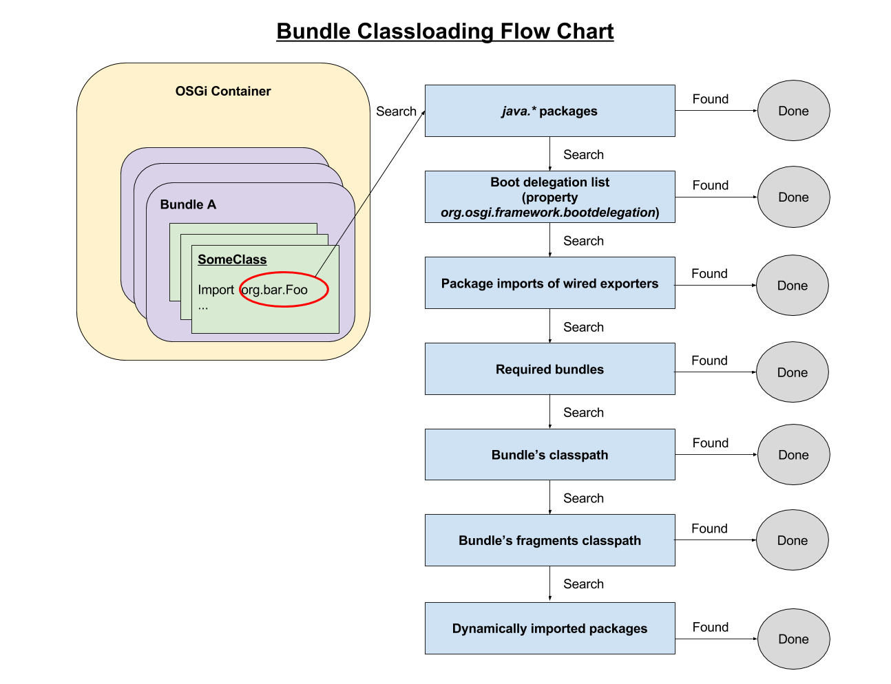

# Bundle Classloading Flow

The OSGi container searches several places for imported classes. It's important  to know where it looks and in what order. Liferay DXP's classloading flow for OSGi  bundles follows the OSGi Core specification. It's straightforward, but complex.  The figure below illustrates the flow and this article walks you through it. 

Here is the algorithm for classloading in a bundle: 

1. If the class is in a `java.*` package, delegate loading to the parent  classloader. Otherwise, continue. 

1. If the class is in the OSGi Framework's boot delegation list, delegate  loading to the parent classloader. Otherwise, continue. 

1. If the class is in one of the packages the bundle imports from a wired  exporter, the exporting bundle's classloader loads it. A *wired exporter* is  another bundle's classloader that previously loaded the package. If the  class isn't found, continue. 

1. If the class is imported by one of the bundle's required bundles, the  required bundle's classloader loads it. 

1. If the class is in the bundle's classpath (manifest header  `Bundle-ClassPath`), the bundle's classloader loads it. Otherwise, continue. 

1. If the class is in the bundle's fragments classpath, the bundle's  classloader loads it. 

1. If the class is in a package that's dynamically imported using  `DynamicImport-Package` and a wire is established with the exporting bundle,  the exporting bundle's classloader loads it. Otherwise, the class isn't  found. 

Congratulations! Now you know how Liferay DXP finds and loads classes for OSGi  bundles. 
