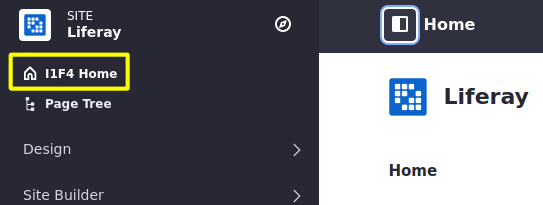
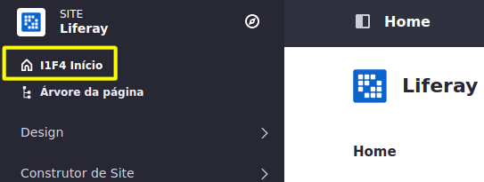

# Overriding Global Language Keys

Liferay DXP/Portal implements headings, labels, and messages for the default locale and many other locales using language keys. You can override these keys for any of the locales using new language key values in a module.

## Examining the Global Language Keys

The global language keys are in the source code and the [DXP/Portal bundle](../../installation-and-upgrades/installing-liferay/hosting-liferay.md).

In the source:

* [`liferay-[dxp|portal]/portal-impl/src/content/Language[_xx_XX].properties`](https://github.com/liferay/liferay-portal/tree/[$LIFERAY_LEARN_PORTAL_GIT_TAG$]/portal-impl/src/content)
* [`liferay-[dxp|portal]/modules/apps/portal-language/portal-language-lang/src/main/resources/content/Language[_xx_XX].properties`](https://github.com/liferay/liferay-portal/tree/[$LIFERAY_LEARN_PORTAL_GIT_TAG$]/modules/apps/portal-language/portal-language-lang/src/main/resources/content)

In the bundle:

* `portal-impl.jar#content/Language[_xx_XX].properties`
* `Liferay Foundation - Liferay Portal Language - Impl.lpkg` &rarr; `com.liferay.portal.language.lang-[version].jar#content/Language[_xx_XX].properties`

Language keys for different languages and locales can be identified by the filename ending. For example, `Language_ja.properties` is for Japanese.

These language key files contain properties that you can override, like the language settings properties: 

```properties
...
lang.user.name.field.names=prefix,first-name,middle-name,last-name,suffix
lang.user.name.prefix.values=Dr,Mr,Ms,Mrs
lang.user.name.required.field.names=last-name
lang.user.name.suffix.values=II,III,IV,Jr,Phd,Sr
...
```

There are also many simple keys you can override for messages and labels.

```properties
category.admin=Admin
category.alfresco=Alfresco
category.christianity=Christianity
category.cms=Content Management
...
```

In Liferay DXP/Portal 7.4+, you can declare overrides using metadata. In earlier versions, Java classes declare the overrides.

If your version is earlier than 7.4, skip ahead to [Overriding in Earlier Versions](#overriding-in-earlier-versions). Otherwise, read on.

## Deploy the Example for 7.4+

This example changes the `home` language key setting to this:

```{literalinclude} ./overriding-global-language-keys/resources/liferay-i2f4.zip/i2f4-impl/src/main/resources/content/Language_en_US.properties
:language: properties
```

Here's how to deploy the example:

1. Start Liferay DXP/Portal. If you don't already have a docker container, use

    ```bash
    docker run -it -m 8g -p 8080:8080 [$LIFERAY_LEARN_PORTAL_DOCKER_IMAGE$]
    ```

    If you're running a different DXP/Portal version, adjust the above command accordingly. 

1. Download and unzip [the latest example](./liferay-i2f4.zip).

    ```bash
    curl https://learn.liferay.com/dxp/latest/en/liferay-internals/extending-liferay/liferay-i2f4.zip -O
    ```

    ```bash
    unzip liferay-i2f4.zip
    ```

1. Build and deploy the project module.

    ```bash
    cd liferay-i2f4
    ```

    ```bash
    ./gradlew deploy -Ddeploy.docker.container.id=$(docker ps -lq)
    ```

    ```{note}
    This command is the same as copying the deployed jars to `/opt/liferay/osgi/modules` on the Docker container.
    ```

1. Confirm the deployment in the Liferay Docker container console.

    ```bash
    STARTED com.acme.i2f4.impl_1.0.0 [3209]
    ```

1. Verify the example module's customization. Open your browser to `https://localhost:8080`.

1. Click the menu icon (). The home icon label uses the custom language key value.

    

1. The example includes custom language key values for multiple locales. For example, use the language selector to select Brazilian Portuguese or Japanese to see the customization in that locale. The module overrides language keys for these locales too.

    

Now that you've seen the example, here's how it works. 

## Create a Language Properties File

Select the keys you want to override. The example module overrides the `home` language key.

```{literalinclude} ./overriding-global-language-keys/resources/liferay-i2f4.zip/i2f4-impl/src/main/resources/content/Language_en_US.properties
:language: properties
```

```{important}
The values for the language keys you declare override the values for those existing keys. All other existing language key settings are preserved.
```

Once you've decided which keys to override, create a language properties file in your module's `src/main/resources/content` folder. Use the file name `Language.properties` to override the default locale's language keys. To override a specific locale's keys, use the language properties file naming convention:

```
Language[_xx_XX].properties
```

For example, if you're overriding Japanese, use `Language_ja.properties`.

## Declare the Override in the Bnd File

In your module's `bnd.bnd` file, specify your language resource provider capability. Here is the example's `Provide-Capability` header:

```{literalinclude} ./overriding-global-language-keys/resources/liferay-i2f4.zip/i2f4-impl/bnd.bnd
:lines: 4-6
```

```{note}
The example omits a service ranking---it uses OSGi's default ranking `0`, which is higher than the default global resource bundle service ranking `-1`.
```

Global language key overrides are easiest to manage when they're in the same module.

Although we don't recommend using multiple modules to override global language keys, if you override the same key in multiple modules, the language resource provider with the highest service ranking wins.

For example, if you want your module's language keys to take priority over keys from a provider that has service ranking `1`, set your ranking to `2` or higher.

```properties
Provide-Capability:\
	liferay.language.resources;\
		resource.bundle.base.name="content.Language";\
		service.ranking:Long="2"
```

Deploy the module to see your new language key values.

## Overriding in Earlier Versions

On Liferay DXP/Portal versions earlier than 7.4, overriding global language keys requires a [language properties file](#create-a-language-properties-file) and a `java.util.ResourceBundle` for each translation being customized. Learn more by deploying the following example and examining its code.

```{note}
Many of the language keys are in the global language key files, but some may be located in specific application modules. The process of [overriding module language keys in earlier versions](./overriding-module-language-keys.md) is different from overriding the global keys.
```

### Deploy the Example for Earlier Versions

This example changes the `publish` language key setting to this:

```{literalinclude} ./overriding-global-language-keys/resources/liferay-x8f3.zip/x8f3-impl/src/main/resources/content/Language_en_US.properties
:language: properties
```

Here's how to deploy the example:

1. Download and unzip [Overriding Global Language Keys](./liferay-x8f3.zip).

    ```bash
    curl https://learn.liferay.com/dxp/latest/en/liferay-internals/extending-liferay/liferay-x8f3.zip -O
    ```

    ```bash
    unzip liferay-x8f3.zip
    ```

1. Build and deploy the project module.

    ```bash
    cd liferay-x8f3
    ```

    ```bash
    ./gradlew deploy -Ddeploy.docker.container.id=$(docker ps -lq)
    ```

1. Confirm the deployment in the Liferay Docker container console.

    ```bash
    STARTED com.acme.x8f3.impl_1.0.0 [3209]
    ```

1. Open your browser to `https://localhost:8080`.

1. Sign in using the default credentials:

    **User Name:** `test@liferay.com`

    **Password:** `test`

1. Navigate to a Site page and click the edit icon (). The publish button shows the custom language key.

    

1. Use the language selector to select Brazilian Portuguese or Japanese to see the custom language key. The module overrides language keys for each locale you include in the module.

    

Like the 7.4+ example, this module specifies custom values in language key files. Instead of using metadata (a `bnd.bnd` file header) to declare the override, however, the module uses `ResourceBundle` classes.

### Create Resource Bundle Classes

Each locale you're overriding requires a class that extends `java.util.ResourceBundle`. Here's the example resource bundle class for the `en_US` locale:

```{literalinclude} ./overriding-global-language-keys/resources/liferay-x8f3.zip/x8f3-impl/src/main/java/com/acme/x8f3/internal/language/X8F3EnglishResourceBundle.java
:dedent: 1
:language: java
:lines: 10-26
```

The class's `_resourceBundle` field is assigned a `ResourceBundle`. The call to `ResourceBundle.getBundle` needs two parameters. The `content.Language_en_US` parameter is the language file's qualified name with respect to the module's `src/main/resources/content` folder. The second parameter is a `control` that sets the language syntax of the resource bundle. To use language syntax identical to Liferay's syntax, import Liferay's `com.liferay.portal.kernel.language.UTF8Control` class and set the second parameter to `UTF8Control.INSTANCE`. 

The class's `@Component` annotation declares it an OSGi `ResourceBundle` service component. Its `language.id` property designates it for the `en_US` locale. 

```{literalinclude} ./overriding-global-language-keys/resources/liferay-x8f3.zip/x8f3-impl/src/main/java/com/acme/x8f3/internal/language/X8F3EnglishResourceBundle.java
:language: java
:lines: 10
```

The class overrides these methods:

**`handleGetObject`:** Looks up the key in the module's resource bundle (which is based on the module's language properties file) and returns the key's value as an `Object`. 

**`getKeys`:** Returns an `Enumeration` of the resource bundle's keys. 

Your resource bundle service component redirects the default language keys to your module's language key overrides.

Global language key overrides for multiple locales require a separate resource bundle class for each locale. For example, the tutorial code has one for Brazilian Portuguese, English, and Japanese. Each resource bundle must specify its locale in the `language.id` component property definition and in the language file qualified name parameter. For example, here is what they look like for the Japanese locale.

Component definition:

```{literalinclude} ./overriding-global-language-keys/resources/liferay-x8f3.zip/x8f3-impl/src/main/java/com/acme/x8f3/internal/language/X8F3JapaneseResourceBundle.java
:language: java
:lines: 10
```

Resource bundle assignment:

```{literalinclude} ./overriding-global-language-keys/resources/liferay-x8f3.zip/x8f3-impl/src/main/java/com/acme/x8f3/internal/language/X8F3JapaneseResourceBundle.java
:dedent: 1
:language: java
:lines: 23-24
```

Deploy your module to see your new language key values.

```{note}
When you're ready to upgrade to DXP 7.4+, you can continue to use your language key override module. Optionally, you can simplify the module by removing the `ResourceBundle` class and specifying the `Provide-Capability` header in your `bnd.bnd` file as demonstrated [above](#declare-the-override-in-the-bnd-file).
```

## Related Information

* [Overriding Module Language Keys in Earlier Versions](./overriding-module-language-keys.md)