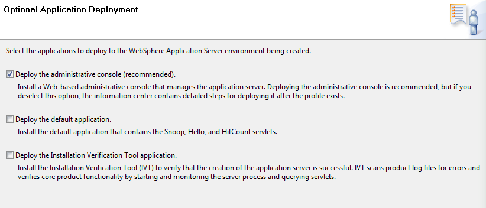
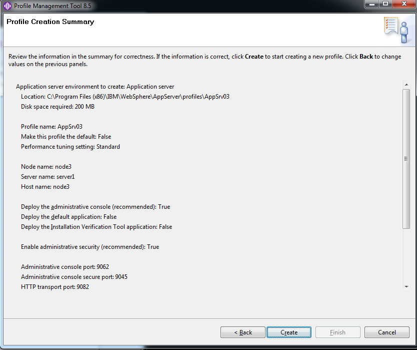
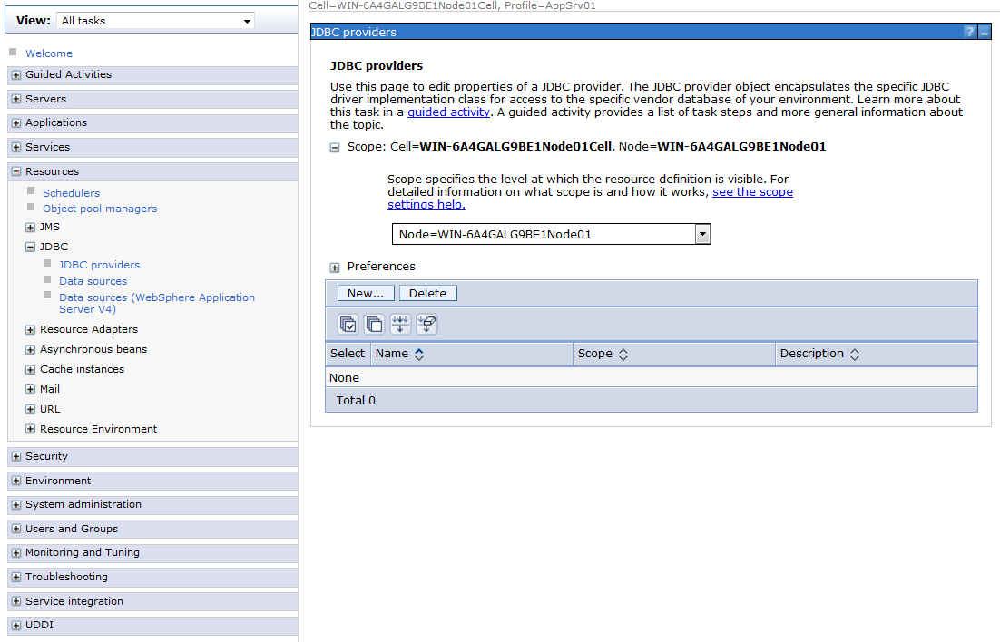
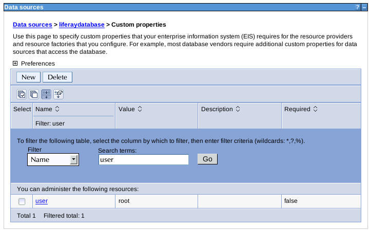
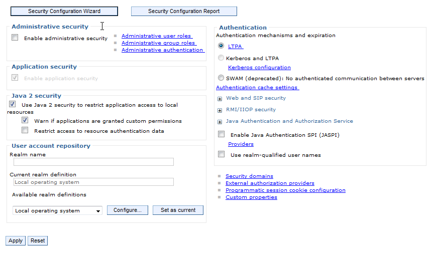
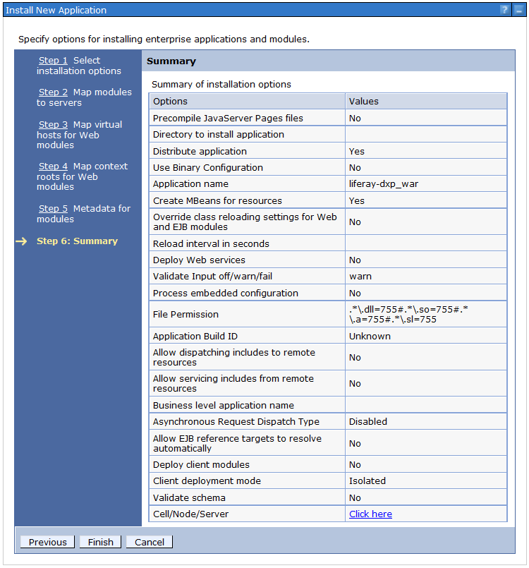

# Installing DXP on WebSphere

IBM&reg; WebSphere&reg; is a trademark of International Business Machines Corporation, registered in many jurisdictions worldwide.

> **Tip:** Throughout this installation and configuration process, WebSphere prompts you to click *Save* to apply changes to the Master Configuration. It is necessary to do so to save the changes.

For Liferay DXP to work correctly, WebSphere 9 (Fix Pack 11 is the latest) must be installed. Go to [IBM Support](http://www-01.ibm.com/support/docview.wss?uid=swg24043005) to find out more information about this fix pack. Liferay DXP does not currently support the WebSphere Application Liberty Profile.

> **Important:** Before installing DXP, please review the [Installation Overview](../02-installation-overview.md) and [Connecting a Database](../04-connecting-a-database.md) articles.

## Prerequisites

The following files are required to install Liferay on the WebSphere application server:

* DXP WAR file
* Dependencies ZIP file
* OSGi Dependencies ZIP file

See [Downloading Liferay DXP](../03-downloading-liferay-dxp.md) to learn more about available Liferay DXP downloads.

The [`LIFERAY_HOME` directory](../../14-reference/01-liferay-home.md) is where Liferay DXP stores and manages files and folders required to function. On WebSphere, the `LIFERAY_HOME` directory is typically `[Install Location]/WebSphere/AppServer/profiles/[your-profile]/liferay`.

## Preparing WebSphere for DXP

### Creating a WebSphere Profile

When the application server binaries have been installed, start the *Profile Management Tool* to create a profile appropriate for DXP.

1. Click *Create...*, choose *Application Server*, and then click *Next*.
1. Click the *Advanced* profile creation option and then click *Next*. Use the advanced profile to specify the values for settings such as the location of the profile and names of the profile, node and host, to assign specific ports, or to optionally choose whether to deploy the administrative console and sample application and also add web-server definitions for IBM HTTP Server. See the WebSphere documentation for more information about these options.

    

1. Check the box *Deploy the administrative console*. This enables a web-based UI for working with the application server. Skip the default applications. (Install these only on a development machine.) Click *Next*.
1. Set the profile name and location. Specify a performance tuning settings appropriate for your environment.

    > **Note:** See the WebSphere documentation for more information about performance tuning settings. Click *Next*.

1. Choose node, server, and host names for the server. These are specific to a user's environment. Click *Next*.
1. Administrative security in WebSphere is a way to restrict who has access to the administrative tools. Administrators may want to have it enabled in the environment so that a user name and password are required to administer the WebSphere server. See WebSphere's documentation for more information. Click *Next*.
1. Each profile needs a security certificate, which comes next in the wizard. If the certificates are not already generated, choose the option to generate a personal certificate and a signing certificate and click *Next*.
1. Once the certificates are generated, set a password for the keystore. Click *Next*.
1. Administrators can customize the ports this server profile uses. Be sure to choose ports that are open on the machine. When choosing ports, the wizard automatically detects existing WebSphere installations and if it finds activity, will increment ports by one.
1. Choose whether to start this profile when the machine starts. Click *Next*.
1. WebSphere ships with IBM HTTP Server. Choose whether you want a web server definition, so that this JVM receives requests forwarded from the HTTP server. See WebSphere's documentation for details on this. When finished, click *Next*.
1. The wizard then displays a summary of what was selected, enabling administrators to keep their choices or go back and change something. When finished, click *Next*.

WebSphere then creates the profile and finishes with a message indicating that the profile was created successfully.



### Configuring the WebSphere Application Server

In this version of WebSphere, servlet filters are not initialized on web application startup, but rather, on first access. This can cause problems when deploying certain apps to DXP. To configure servlet filters to initialize on application startup (i.e., deployment), set the following `webcontainer` properties in the WebSphere application server:

```properties
com.ibm.ws.webcontainer.initFilterBeforeInitServlet = true
com.ibm.ws.webcontainer.invokeFilterInitAtStartup = true
```

To set `webcontainer` properties in the WebSphere application server, follow the instructions [in WebSphere's documentation](http://www-01.ibm.com/support/docview.wss?rss=180&uid=swg21284395).

### Setting up JVM Parameters for Liferay DXP

Next, in the WebSphere profile, set an argument that supports DXP's JVM requirements. Modify this file:

`[Install Location]/WebSphere/AppServer/profiles/your-profile/config/cells/your-cell/nodes/your-node/servers/your-server/server.xml`

As a baseline, add `maximumHeapSize="2560"` inside the `jvmEntries` tag. For example:

```xml
<jvmEntries xmi:id="JavaVirtualMachine_1183122130078" ... maximumHeapSize="2560">
```

> **Note:** The JVM parameters used here are defaults intended for initial deployment of production systems. Administrators should change the settings to values that best address their specific environments. These must be tuned depending on need.

Administrators can set the UTF-8 properties in the `<jvmEntries genericJvmArguments=.../>` attribute in `server.xml`. This is required or else international characters will not be parsed correctly. Set the maximum and minimum heap sizes to `2560m` there too. Add the following inside the `jvmEntries` tag:

```xml
<jvmEntries xmi:id="JavaVirtualMachine_1183122130078" ...genericJvmArguments="-Dfile.encoding=UTF-8 -Duser.timezone=GMT -Xms2560m -Xmx2560m">
```

> **Important:** For DXP to work properly, the application server JVM must use the `GMT` time zone and `UTF-8` file encoding.

Alternately, set the UTF-8 properties from the WebSphere Admin Console. (See below.)

### Removing the `secureSessionCookie` Tag

In the same profile, delete a problematic `secureSessionCookie` tag that can cause DXP startup errors. Note that this is just a default setting; once DXP is installed, you should tune it appropriately based on your usage.

In `[Install Location]/WebSphere/AppServer/profiles/your-profile/config/cells/your-cell/cell.xml`, delete the `secureSessionCookie` tag containing `xmi:id="SecureSessionCookie_1"`.

If this tag is not removed, an error similar to this may occur:

```log
WSVR0501E: Error creating component com.ibm.ws.runtime.component.CompositionUnitMgrImpl@d74fa901
com.ibm.ws.exception.RuntimeWarning: com.ibm.ws.webcontainer.exception.WebAppNotLoadedException: Failed to load webapp: Failed to load webapp: SRVE8111E: The application, LiferayEAR, is trying to modify a cookie which matches a pattern in the restricted programmatic session cookies list [domain=*, name=JSESSIONID, path=/].
```

### Configuration Checkpoint

By this point, the following steps should be completed:

1. The WebSphere Application Server profile has been created.
1. Servlet filters have been configured to initialize on application startup in the `webcontainer` settings.
1. The JVM parameters have been set in the `server.xml` file.
1. UTF-8 has been set as the file encoding.
1. The server's time zone is set to GMT.
1. The `secureSessionCookie` tag has been removed.

## Installing DXP Dependencies

1. Unzip the Dependencies ZIP file and place its contents in the WebSphere application server's `[Install Location]/WebSphere/AppServer/lib/ext` folder. Add the appropriate JDBC connector JAR for the database being used to this location as well.
1. From the same archive, copy `portlet.jar`into `[Install Location]/WebSphere/AppServer/javaext` for WebSphere 9.0.0.x. WebSphere already contains an older version of `portlet.jar` which must be overridden at the highest class loader level. The new `portlet.jar` (version 3) is backwards-compatible.
1. Unzip the OSGi Dependencies ZIP file and place its contents in the `[LIFERAY_HOME]/osgi` folder (create this folder if it doesn't already exist). This is typically `[Install Location]/WebSphere/AppServer/profiles/your-profile/liferay/osgi`.

Before starting the server, verify that the following jars have been copied to the correct folders. The following files should be present within the `lib/ext` (WebSphere Application) folder:

1. `com.liferay.petra.concurrent.jar`
1. `com.liferay.petra.executor.jar`
1. `com.liferay.petra.function.jar`
1. `com.liferay.petra.io.jar`
1. `com.liferay.petra.lang.jar`
1. `com.liferay.petra.memory.jar`
1. `com.liferay.petra.nio.jar`
1. `com.liferay.petra.process.jar`
1. `com.liferay.petra.reflect.jar`
1. `com.liferay.petra.string.jar`
1. `com.liferay.registry.api.jar`
1. `hsql.jar`
1. The relevant JDBC database connector jar (e.g. MySQL, MariaDB, IBM DB2, Postgres for production)
1. `portal-kernel.jar`
1. `portlet.jar`

The following folders should be present within the `[LIFERAY_HOME]/liferay/osgi` folder:

1. `configs`
1. `core`
1. `marketplace`
1. `modules`
1. `portal`
1. `state`
1. `static`
1. `war`

### Ensuring That the DXP Portlet.jar is Loaded First

In addition to placing the `portlet.jar` in the correct folder, configure the `config.ini` file so that it is loaded first. Navigate to `/IBM/WebSphere/AppServer/configuration/config.ini`.

1. Find the property `com.ibm.CORBA,com.ibm`
1. Insert the property
    `javax.portlet,javax.portlet.filter,javax.portlet.annotations`
    after `com.ibm.CORBA` and before `com.ibm`.
1. Save the file.

### Dependencies Checkpoint

1. DXP dependencies have been installed.
1. The `config.ini` file has been configured.

Start the application server profile.

## Database Configuration

Administrators can use either Liferay's built-in Data Source Configuration or use WebSphere to manage their database connections.
If using WebSphere to manage the database connections, follow the instructions below. Skip this section if you plan to use DXP's built in data source. See [Connecting a Database](../04-connecting-a-database.md) for more information.

> **Warning:** Liferay uses HSQL by default for demo purposes. HSQL should _not_ be used in production instances of Liferay DXP.



1. Start WebSphere.
1. Open the Administrative Console and log in.
1. Click *Resources &rarr; JDBC Providers*.
1. Select a scope and then click *New*.
1. Select the database type, provider type, and implementation type. If selecting a predefined database, the wizard fills automatically in the name and description fields. If the desired database isn't listed, select *User-defined* from the *Database type* field and then fill in the *Implementation Class Name*. For example, if using MySQL, select *Database type* &rarr; *User-defined*, and then enter `com.mysql.jdbc.jdbc2.optional.MysqlConnectionPoolDataSource` in *Implementation Class Name*. Click *Next*.
1. Clear any text in the class path settings. The necessary JARs have already been copied to a location on the server's class path. Click *Next*.
1. Review the settings and click *Finish*. The final configuration should look like this:

    

1. Click the new provider configuration when it appears in the table.
1. Click *Data Sources* under *Additional Properties*.
1. Click *New*.
1. Enter `liferaydatabasesource` in the *Data source name* field and `jdbc/LiferayPool` in the *JNDI name* field. Click *Next*.
1. Click *Next* in the remaining screens of the wizard to accept the default values. Then review all the changes and click *Finish*.
1. Click the data source when it appears in the table and then click *Custom Properties*.
1. Click the *Show Filter Function* button. This is the second from last of the small icons under the *New* and *Delete* buttons.
1. Enter *user* into the search terms and click *Go*.

    

1. Select the *user* property and give it the value of the user name to the database.
1. Click *OK* and save to master configuration.
1. Do another filter search for the *url* property. Give this property a value that points to the database. For example, a MySQL URL would look like this:

    ```properties
    jdbc:mysql://localhost/lportal?useUnicode=true&characterEncoding=UTF-8&useFastDateParsing=false
    ```

    > **Tip:** For more example URLs, see the `jdbc.default.url` values in [Database Templates](../../14-reference/05-database-templates.md).

    Click *OK* and save to master configuration.

1. Do another filter search for the *password* property. Enter the password for the user ID added earlier as the value for this property. Click *OK* and save to master configuration.
1. Go back to the data source page by clicking it in the breadcrumb trail. Use the *Test Connection* button to validate configurations to this point.

## Mail Configuration

If using DXP's built-in mail sessions, skip this section. See the [Configuring Mail](https://help.liferay.com/hc/articles/360029031591-Configuring-Mail) article on how to use DXP's built-in mail sessions.

Administrators who wish to use WebSphere to manage their mail sessions can use the following procedure.

### Creating a WebSphere-Managed Mail Session

1. Click *Resources &rarr; Mail &rarr; Mail Providers*.
1. Click the Built-In Mail Provider for the node and server.
1. Click *Mail Sessions* and then click the *New* button.
1. Give the mail session a name of `liferaymail` and a JNDI name of `mail/MailSession`. Fill in the correct information for your mail server in the sections *Outgoing Mail Properties* and *Incoming Mail Properties*. Click *OK* and then save to the master configuration.
1. Click the mail session when it appears in the table and select *Custom Properties* under the *Additional Properties* section. Set any other JavaMail properties required by the mail server, such as the protocol, ports, whether to use SSL, and so on.
1. Click *Security &rarr; Global Security* and de-select *Use Java 2 security to restrict application access to local resources* if it is selected.

    

1. Click *Apply*.

Note that it might be necessary to retrieve a SSL certificate from mail server and add it to WebSphere's trust store. See WebSphere's documentation for instructions on this.

### Verifying WebSphere Mail Provider

To validate that the mail session has been configured correctly, there are a number of ways to test this once the WAR has been deployed, the server has started, and the user has signed in as the system administrator. One quick way to validate is to create a new user with a valid email account. The newly created user should receive an email notification. The logs should display that the SMTP server has been pinged with the correct port number listed.

## Enable Cookies for HTTP Sessions

WebSphere restricts cookies to HTTPS sessions by default. If using HTTP, this prevents users from signing in to DXP and displays the following error in the console:

```log
20:07:14,021 WARN  [WebContainer : 1][SecurityPortletContainerWrapper:341]
User 0 is not allowed to access URL http://localhost:9081/web/guest/home and
portlet com_liferay_login_web_portlet_LoginPortlet
```

This occurs because DXP cannot use the HTTPS cookie when using HTTP. The end result is that new sessions are created on each page refresh. Follow these steps to resolve this issue in WebSphere:

1. Click *Application Servers* &rarr; *server1* &rarr; *Session Management* &rarr; *Enable Cookies*.
1. De-select *Restrict cookies to HTTPS sessions*.
1. Click *Apply*.
1. Click *Save*.

## Enable UTF-8

If UTF-8 has not been enabled by adding the `-Dfile.encoding=UTF-8` property in the `server.xml`, administrators can also do so in the Administrative Console.

1. Click *Application Servers* &rarr; *server1* &rarr; *Process definition*.
1. Click *Java Virtual Machine* under *Additional Properties*.
1. Enter `-Dfile.encoding=UTF-8` in the *Generic JVM arguments* field.
1. Click *Apply* and then *Save* to master configuration.

Once the changes have been saved, DXP can parse special characters if there is localized content.

## Deploying the DXP `.war` File

1. In WebSphere's administrative console, click *Applications* &rarr; *New Application* &rarr; *New Enterprise Application*.
1. Browse to the DXP `.war` file, select it, and click *Next*.
1. Leave *Fast Path* selected and click *Next*. Ensure that *Distribute Application* has been checked and click *Next* again.
1. Choose the WebSphere runtimes and/or clusters where DXP is to be deployed. Click *Next*.
1. Select the virtual host to deploy DXP on and click *Next*.
1. Map DXP to the root context (`/`) and click *Next*.
1. Select the desired *metadata-complete attribute* setting and click *Next*.
1. Verify that the settings are correct and click *Finish*.
1. When DXP has installed, click *Save to Master Configuration*.

   

DXP has been installed. There are a few more required steps before starting DXP.

## Setting the JDK Version for Compiling JSPs

DXP requires that its JSPs are compiled to the Java 8 bytecode format. To ensure that WebSphere does this, shut down WebSphere after you've deployed the DXP `.war` file. Navigate to the `WEB_INF` folder and add the following setting to the `ibm-web-ext.xml` or in most cases the `ibm-web-ext.xmi` file:

```xml
<jsp-attribute name="jdkSourceLevel" value="18" />
```

The exact path to the `ibm-web-ext.xmi` file depends on the WebSphere installation location and DXP version, but here's an example:

```bash
/opt/IBM/WebSphere/AppServer/profiles/AppSrv01/config/cells/localhostNode01Cell/applications/liferayXX.ear/deployments/liferayXX/liferayXX.war/WEB-INF/ibm-web-ext.xmi
```

Note that the DXP `.war` comes pre-packaged with the `ibm-web-ext.xmi` file; this format is functionally the same as `.xml` and WebSphere recognizes both formats. For more general information on how WebSphere compiles JSPs see IBM's official documentation for [WebSphere Application Server 9.0.0.x](https://www.ibm.com/support/knowledgecenter/en/SSEQTP_9.0.0/com.ibm.websphere.base.doc/ae/rweb_jspengine.html).

## Start DXP

1. Start the application server.
1. If administrators are using DXP's [setup wizard](../05-using-the-setup-wizard.md), skip to the next step. However, if administrators are using WebSphere's data source and mail session, create a file called `portal-ext.properties` in the Liferay Home folder. Place the following configuration in the file:

    ```properties
    jdbc.default.jndi.name=jdbc/LiferayPool
    mail.session.jndi.name=mail/MailSession
    setup.wizard.enabled=false
    ```

1. In the WebSphere administrative console, navigate to *Enterprise Applications*, select the DXP application, and click *Start*. While DXP is starting, WebSphere displays a spinning graphic.
1. In DXP's setup wizard, select and configure the database type. Click *Finish*. DXP then creates the tables it needs in the database.

After deploying DXP, there may be excessive warnings and log messages, such as the ones below, involving `PhaseOptimizer`. These are benign and can be ignored. Make sure to adjust the app server's logging level or log filters to avoid excessive benign log messages.

```log
|     May 02, 2018 9:12:27 PM com.google.javascript.jscomp.PhaseOptimizer$NamedPass process
|     WARNING: Skipping pass gatherExternProperties
|     May 02, 2018 9:12:27 PM com.google.javascript.jscomp.PhaseOptimizer$NamedPass process
|     WARNING: Skipping pass checkControlFlow
|     May 02, 2018 9:12:27 PM com.google.javascript.jscomp.PhaseOptimizer$NamedPass process
|     INFO: pass supports: [ES3 keywords as identifiers, getters, reserved words as properties, setters, string continuation, trailing comma, array pattern rest, arrow function, binary literal, block-scoped function declaration, class, computed property, const declaration, default parameter, destructuring, extended object literal, for-of loop, generator, let declaration, member declaration, new.target, octal literal, RegExp flag 'u', RegExp flag 'y', rest parameter, spread expression, super, template literal, modules, exponent operator (**), async function, trailing comma in param list]
|     current AST contains: [ES3 keywords as identifiers, getters, reserved words as properties, setters, string continuation, trailing comma, array pattern rest, arrow function, binary literal, block-scoped function declaration, class, computed property, const declaration, default parameter, destructuring, extended object literal, for-of loop, generator, let declaration, member declaration, new.target, octal literal, RegExp flag 'u', RegExp flag 'y', rest parameter, spread expression, super, template literal, exponent operator (**), async function, trailing comma in param list, object literals with spread, object pattern rest]
```

## Next Steps

* [Installation Overview](../02-installation-overview.md)
* Configuration Overview
* Installing and Configuring a Search Engine
* Securing Liferay DXP
* Configuring Clustering for High Availability
* Maintaining Liferay DXP
