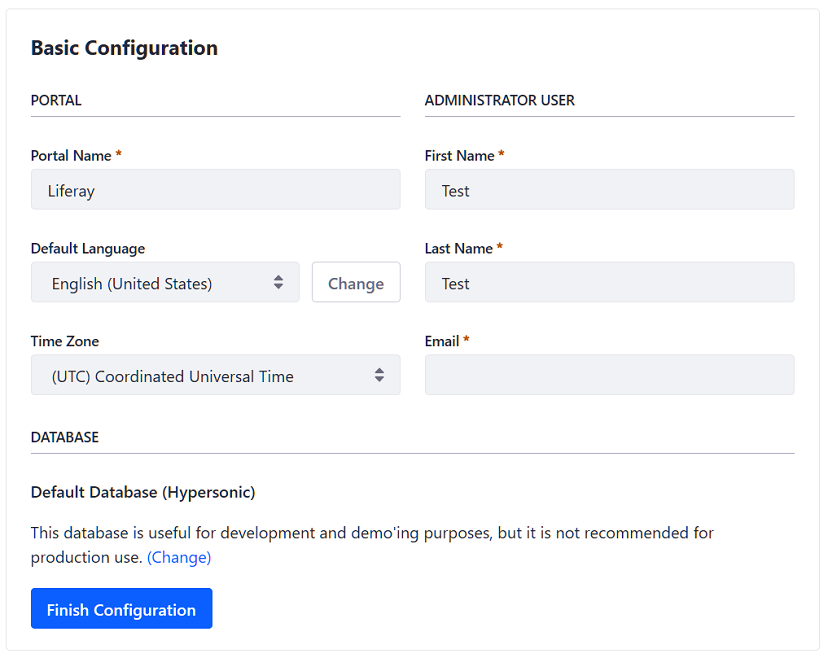

# Using the Setup Wizard

The entry point for many users starting Liferay DXP for the first time is the Setup Wizard. The Setup Wizard provides a convenient way to configure the following:

* Locale and Timezone
* Configuring the Admin User
* Connecting a Database

> **Note**: Experienced users who have already configured Liferay by creating `.properties` files can disable and skip using the Setup Wizard by appending `setup.wizard.enabled=false` to an already created `.properties` file.

## Portal Configuration Reference

| Field | Description |
| --- | --- |
| **Portal Name** | Name of the site being created |
| **Default Language** | Determines the default site locale |
| **Time Zone**  | The instance's default time zone |

## Administrator User Configuration Reference

| Field | Description |
| --- | --- |
| **First Name** | The administrator user's first name |
| **Last Name** | The administrator user's last name |
| **Email** | The administrator user's email address |

> **Note:** the administrator user's email domain is used as the DXP 7.2 instance's default domain (i.e., the [`company.default.web.id`](https://docs.liferay.com/dxp/portal/7.2-latest/propertiesdoc/portal.properties.html#Company) [portal property](../14-reference/03-portal-properties.md)).

## Database Configuration Reference

> **Important:** If a database has not been created yet, create one now following [database preparation instructions](./04-connecting-a-database.md) article.

Click the *Change* link if using DXP 7.2's built-in data source and configuring it to use the [database you created earlier](./04-connecting-a-database.md).

| Field | Description |
| --- | --- |
| **Database Type** | Select the database type to connect to |
| **JDBC URL** | Update the path to the database that has already been created for Liferay DXP |
| **User Name** | Database user name |
| **Password** | Database user password |
| **Sample Data** | Flagging this value will result in Users, Sites, and Organizations being created for demonstration purposes |

> **Warning:** HSQL should not be used in production instances of Liferay DXP.

## Completing the Setup Wizard

After filling out the Basic Configuration form, click *Finish Configuration*.

The setup wizard creates a `[LIFERAY_HOME]/portal-setup-wizard.properties` file which stores the settings that you entered. For further configurations or customizations, use a [`portal-ext.properties`](../14-reference/03-portal-properties.md) file to make configurations or customizations without directly changing `portal.properties`.

> **Note:** Property values in `portal-setup-wizard.properties` (the file the setup wizards creates in [Liferay Home](../14-reference/01-liferay-home.md)) override property values in `portal-ext.properties`.

On finishing basic configuration, DXP prompts you to restart the server. DXP 7.2 initializes the database during the second startup process.

## Next Steps

* [Installing a Liferay DXP Tomcat Bundle](./installing-a-liferay-dxp-tomcat-bundle.md)
* Activating Liferay DXP
* Configuration Overview
* Installing and Configuring a Search Engine
* Securing Liferay DXP
* Configuring Clustering for High Availability
* Maintaining Liferay DXP
